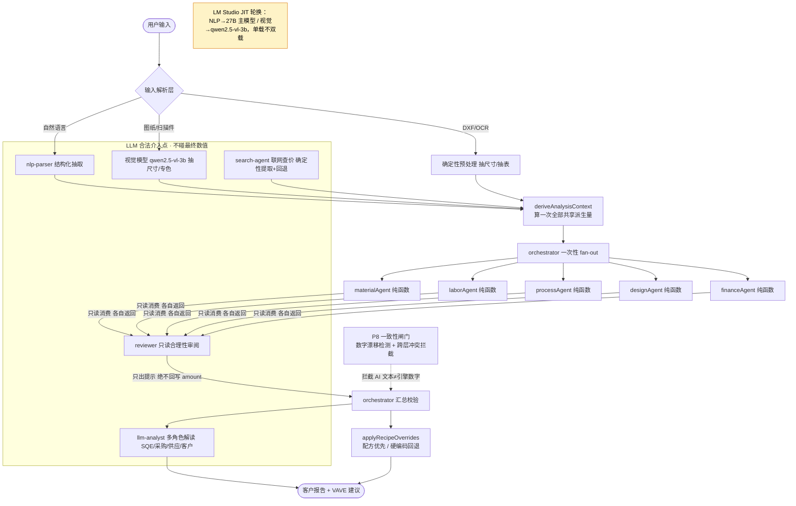
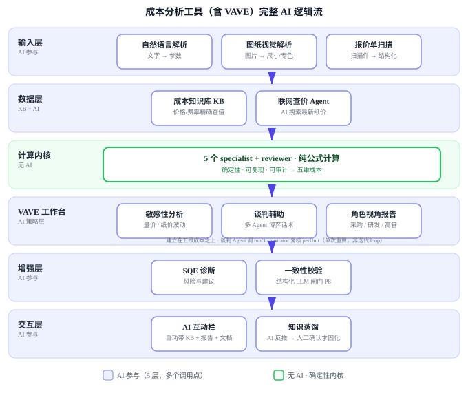

# 包装降本分析工作台 — 项目状态报告

> **用途**：本项目单一真相源（single source of truth）。每次有代码/文档/配置改动，更新本文件的「变更日志」与对应章节，避免在长对话里反复重读整个项目上下文。
> **最后更新**：2026-08-29
> **代码基线**：方法论文档以提交 `b12e3ad`（当前本地 main HEAD）之后为准。全部优化已分 7 次提交落本地 `main`（未 push 到 origin）：`37173a5`(F3/F4 引擎+kb 兜底) / `3be6a54`(F5 管理后台) / `728b0d0`(解析导入) / `e6ba2f3`(AI 设置) / `6a8e69c`(UI 收敛) / `ab32d6b`(schema/文档/配置) / `b12e3ad`(清理误提交缓存)。

---

## 1. 项目概览

- **定位**：包装成本估算与VAVE降本分析工作台，面向 VAVE/降本场景。上传图纸/报价单 → 解析 → 多 Agent 成本分析 → 透明拆解报告 + VAVE 优化提案 → PDF/分享链接。
- **当前范围**：已配置「彩印纸盒（color_print_box）」「平面彩印（flat_print）」「瓦楞纸箱（corrugated_box）」「不干胶标签（label）」四类产品；架构支持多产品（见 `src/config/products/`，注册即扩展，首页品类卡片自动列出）。平面彩印复用五维成本框架，仅派生量与各 Agent 公式按品类分支；瓦楞纸箱复用彩盒五维引擎，仅材料 Agent 走专属分层纸板计算；**不干胶标签（2026-08-29 落地）判定为 B 近级，与 flat_print 同属「平面策略家族」，零算法重写——派生量走单张面积（长×宽）、5 维 Agent 全部复用 `flatXxxAgent`、配方复用 `FLAT_*` 行**。
- **价值主张**：透明可解释（每维有计算依据与假设）、多维度拆解、优化建议（VAVE 方向）。
- **精度定位**：经验合理级（±10%~20% 经验区间），非可报价级；靠真实案例校准向 ±10% 收敛（见 §6 校准）。

---

## 2. 技术栈与运行

| 项 | 内容 |
|---|---|
| 框架 | Next.js 15.1.6（App Router）、React 19、TypeScript 5.7 |
| 样式 | Tailwind CSS 3.4 + lucide-react 图标 |
| 数据库 | Prisma 6.5 + SQLite（默认）；可选 Postgres（schema.prisma） |
| 报告导出 | jsPDF + jspdf-autotable；图表 recharts |
| 脚本运行 | tsx（`node_modules/.bin/tsx` 或 `npm run <script>`） |
| AI/LLM | 走 `src/lib/llm/client.ts`，配置存浏览器 localStorage；未配环境变量时全程规则/模板回退 |

### 运行命令
```
npm run dev       # 本地开发（见下方注意）
npm run build     # 生产构建
npm run start     # 生产启动
npm run test                 # calc-test.ts 计算测试
npm run test:calibration     # calibration-test.ts 合成回归基线
npm run test:calibration:real  # calibration-real.ts 真实案例校准
npm run seed      # 数据库种子
```

### ⚠️ 本地 dev 启动注意（反复踩坑）
- 项目在本地 `/Users/blair/成本分析`（非沙箱）。用 WorkBuddy 跑 `npm run dev` **必须 `dangerouslyDisableSandbox`**，否则监听端口/写 `.next` 被拦。
- **删除门禁**：WorkBuddy safe-delete 会拦截「单次批量删 50+ 文件」。Next dev 启动清理已存在的 `.next` 会触发它导致 server 起不来（502/500）。
- **标准重启动作**：先 `mv -f .next ".next.bak-$(date +%s)"` 移走旧构建，再启动；首次编译无删除即不触发门禁。
- 默认端口 3000。

---

## 3. 架构与数据流

```
用户输入(input) → applyDefaults(FIELD_DEFAULTS 行业默认 + 默认假设清单透明展示)
   → deriveAnalysisContext(一次算出所有共享派生量：净/拼版/印刷/表面有效面积、数量、损耗率、盒型系数等，dataflow 单一真相源)
   → 5 个 specialist agent 只读消费 ctx：
        materialAgent   材料（含油墨，见 §4）
        laborAgent      人工（唯一随地域浮动，见 §4）
        processAgent    加工费（工艺/设备拆分，见 §4）
        designAgent     设计制版（一次性固定费）
        financeAgent    财务（物流简化、包装、管理、利润）
        reviewer        只读跨维度审阅器（不重算、不互调）
   → validate(仅 warning，不报 error；占比越界/小批量判为「真实成本特征」)
   → 9 模块客户报告 + PDF 导出
```

**关键架构决策（2026-08-23 用户确认）**
- 5 个 specialist 是**纯规则确定性函数**，不调 LLM；各自从 ctx 读共享派生量（消除重复计算、单一真相源）。
- **禁止**在 specialist 间引入自由迭代 loop（A↔B 重算）→ 数值正反馈振荡、无收敛判据死循环、破坏可追溯。
- **只读跨维度审阅器 + 未来精度提升**（分区覆盖）是唯一允许的非零通信形态，属铺路型。
- 二期 VAVE 谈判模拟（多 agent 协作 loop）应为独立工作台，不串现有 6 个成本 specialist。

---

## 3.1 AI 介入架构准则（项目级，2026-08-25 确立，2026-08-26 经用户评审修订）

> 适用范围：全项目（成本分析引擎 + VAVE 模块）。原则：数字底座确定性，AI 作用于上下文/感知/判定/排序/表达/探索层，且必须遵守两条守恒 + 可溯源。

**两条守恒（铁律，不可违反）**
- **事实守恒**：AI 消费的事实必须由确定性/结构化来源提供，AI 不得发明事实。
- **数字守恒**：最终报客户的成本数字仍由引擎产生，AI 不生成数字，只生成「对数字的说法」。

**第三条铁律：可溯源性（Audit Trail）**
- 表达层/谈判层所有金额、降本%、工期等数字，必须带数据来源标记（Data Pointer），可高亮回溯到成本引擎原始 JSON 明细。客户/采购随时可验证「这笔钱怎么算的」。

**AI 介入分层（全项目 7 层 + 规则过滤）**
| 层 | AI 角色 | 介入方式（含确定性锚） |
|---|---|---|
| 上下文层 | 整合者 | 判定/排序前，确定性拉取动态行情（纸价/运费/产能，接三期数据底座 API/ERP）+ AI 语义整合与波动归因；AI 不生成行情数字 |
| 输入解析 | 感知者 | **确定性预处理先做**（DXF/DWG 矢量提取尺寸、OCR 抽表格矩阵）→ AI 仅做语义对齐/实体归一化/缺失推断；AI 不发明图纸尺寸，输出须人工确认 + 回引擎验证 |
| 计算 | 不介入 | 5 维引擎确定性 |
| 判定 | 解释者 | 规则算布尔（冲突/超限），AI 消费证据生成「严重度+为什么+修复建议」；触发条件确定性 |
| 规则过滤→AI 软排序 | 过滤网+权衡者 | **先确定性 Rule Filter 一票否决硬约束**（物理强度/客户规范锁定/MOQ 下限）→ 剩余可行集内 AI 按供应商能力/交期/可实施性加权软排序 + 解释 |
| 表达 | 叙述者 | 各角色口吻综合全量结果生成报告/话术；数字带 Data Pointer 可溯源 |
| 谈判 | 博弈者 | 多 agent 角色扮演，每轮新报价回引擎 verify；话术数字带 Data Pointer |
| 知识沉淀 | 飞轮 | 真实案例对比「引擎估算 vs 实际成交」→ AI 反推待固化规则 → **入 `pendingRules` 待审核池，硬闸门：须 SQE 手动确认固化，禁 AI 直写生产库** |

**介入纪律**
- 每个 AI 介入点须有「确定性锚」：要么输入事实确定，要么输出可回引擎验证。
- 硬约束（物理规律/客户规范）一律确定性 Rule Filter 前置，AI 不做「加权放过」。
- 渐进落地：表达层/判定层/排序先行；输入解析（需视觉模型+预处理）、上下文层（需三期数据底座）、知识沉淀做长期飞轮。
- 本地模型限制不阻塞架构（可用商业大模型，前提数据脱敏/不出公网合规）。

**客户报告结构（表达层设计依据）**：一页结论（省多少/风险可控/符合规范）→ 方案矩阵（选项/降本/风险/合规/优先级）→ before-after 成本瀑布 → 实施路径（样品→小批→量产）→ 风险与缓解（主动暴露）。客户信任来自「把坑都标了 + 显式声明符合其规范 + 每个数字可点开看算法」。

### 3.1.1 成本引擎 5 specialist 协同契约（2026-08-29 确立，已固化为代码护栏）

> 与 §3.1 互补：§3.1 规定「AI 在哪里介入」，本节规定「6 个成本 agent 之间怎么协作」。已写入 `orchestrator.ts` 与 `specialists.ts` 文件头作为护栏注释。

**协作形态：一次性 fan-out + 共享派生上下文（dataflow），不是 message-passing。**
- `deriveAnalysisContext()` 算一次全部共享派生量（净展开面积 / 拼版后面积 / 印刷有效面积 / 表面有效面积 / 数量 / 损耗率 / 盒型系数等），以**只读**方式传给各 specialist；每个 agent 各自算完即返回，**没有第二轮、没有 agent 间互调**。

**硬性禁止（不要"优化"成这些形态）**
- ✗ 让 specialist A 的输出喂给 B 触发重算（自由迭代 loop）→ 数值正反馈振荡、无收敛判据、可能死循环；
- ✗ specialist 之间互相 import / 互相调用；
- ✗ specialist 内部调用 LLM。

**理由**：5 个 specialist 是**确定性纯函数**，同样输入必须永远得同样的数，这是「可复现 / 可审计」的地基。自由迭代对此零增益，却会毁掉可追溯性与收敛性。

**AI 的合法位置（只此四处，且不碰最终数值）**：① 输入解析（语言/图纸/扫描件）；② 数据层联网查价（读不到优雅回退本地基准）；③ 结果**合理性**审阅——**只出提示、绝不回写 amount**；④ 解读层文字生成（SQE 诊断 / 角色视角报告）。
> 一句话：**数值对不对归公式，合不合理才问 AI。**

#### 3.1.2 AI 逻辑流示意图（2026-08-29 补，mermaid 渲染）



#### 3.1.3 完整 AI 逻辑流（含 VAVE，2026-08-29 重绘）

> 独立 SVG 文件：`docs/ai-layer-diagram.svg`（六层：输入层 / 数据层 / 计算内核 / **VAVE 工作台** / 增强层 / 交互层）。VAVE 工作台明确画在计算内核之上，并标注「建立在五维成本之上 · 多 Agent 仅策略层，不串计算 loop」——对应 §3.2 中 VAVE 多 Agent 协作边界。



**相关护栏**：`npm run test:golden`（改任何公式/系数前必跑）。注意 **KB 优先于代码常量**——改 `cost-rules` 常量可能被 KB 同名条目覆盖而不生效、回归也测不出来（见 §8 波次 2）。

### 3.2 AI 融入实施计划（详见 `docs/ai-integration-plan.md` v1.1）

> 把 §3.1 准则映射到现有代码结构、分批改造的协同作战路线。现状：项目已散落 4 个 AI 接入点（`nlp-parser` / `search-agent` / `llm-analyst` / `reviewer`），但各自为战、未对齐准则，且部分**踩了 §3.1 红线**（见计划文档「现状盘点」）。

**两处用户硬约束（2026-08-26 评审，已写入计划，不可逾越）**
- **硬约束 A · 上下文与表达/判定紧耦合**：阶段 5（实时上下文层）完善前，阶段 1（多角色表达）/ 阶段 2（判定解释）必须读取**本地基准戳**（`MATERIAL_PRICES_META.asOf`，计划 P0.5 新增）作为时效 Context，使 AI 解释自带「基于本地基准价（asOf X，未含实时行情）」时效边界，不偏向静态、不暗示实时行情。
- **硬约束 B · 知识沉淀人工闸门**：阶段 7 AI 反推的待固化规则**禁止直写生产规则库/知识库/代码**，必须入 `pendingRules` 待审核池，由 SQE/工程师手动「确认固化」后才转为确定性配置。AI 在知识沉淀层仅有提案权、无写入权。

**阶段路线（建议起步：P0+P0.5+P1+P2+P3，纯代码、不依赖外部数据）**
| 阶段 | 准则层 | 要点 |
|---|---|---|
| P0 | 全部 | `llm/structured.ts` 统一结构化调用+回退，收敛分散 prompt |
| P0.5 | 上下文(轻) | 新增 `MATERIAL_PRICES_META` 基准戳常量，供 P1/P2 注入时效 |
| P1 | 表达+铁律3 | 多角色表达（采购/供应/成本/客户）+ Data Pointer 可溯源 + 时效戳 |
| P2 | 判定 | `judge-explain.ts`：规则证据→AI 解释，触发布尔仍确定性 |
| P3 | 规则过滤→软排序 | 确定性 Rule Filter 一票否决 → 可行集内 AI 软排序+解释 |
| P4 | 输入解析 | ✅ DXF/文本确定性尺寸抽取前置（`extractDeterministicDimensions`），视觉 LLM 仅语义对齐；AI 抽取字段标 `ai_extracted`+`requiresHumanConfirmation`（修评审一.1 坑） |
| P5 | 上下文 | ✅ `searchPaperPrice` 价格改确定性基准（AI 只出趋势），新增 `context-layer.ts` 聚合 `MATERIAL_PRICES_META` 时效戳注入 P1/P2（修数字守恒违规 + 评审二.1） |
| P6 | 谈判 | ✅ `negotiation-agent.ts` 三方角色博弈 + 每轮 `verifyScenarioPerUnit` 回引擎校验 + Data Pointer；`/api/vave/negotiate` |
| P7 | 知识沉淀 | ✅ `knowledge-distill.ts` 案例对比→反推规则（仅提案）+ `pending-rules.ts` 人工闸门（AI 无写入权，确认才转 KB override）+ `/api/vave/distill` + 工作台「知识沉淀」tab |
| P8 | 一致性闸门（守门） | ✅ `agents/consistency-gate.ts`：① 数字漂移检测（AI 文本金额/百分比 vs Pointer 真实数字超容差告警，挂 `driftWarnings`）② 跨层冲突拦截（判定/排序否决但文本称可行 → 强制以确定性结论为准，产 `contradiction`/`cross_layer` 告警）③ 审计日志（每次 AI 调用落盘 `logs/ai-audit.jsonl` + 内存环形）④ 统一返回管道 `runGated` 挂载 P1/P2/P3/P6/P7(知识沉淀)/SQE/解析 + `search-agent`(行情) 审计；`nlp-parser` 维持底层 `chatCompletion`+审计（原始文本输出，强套 JSON 不合适，属有意设计）；编排层聚合 `AnalysisReport.consistencyWarnings` |
| P9 | 降本规则闭环（待审批区清理） | ✅ `vave/rule-lifecycle.ts`（纯逻辑、客户端安全）：① `pendingRuleToRuleTemplate` 把 LLM 蒸馏提案(`PendingRule`)确定性转换为结构化规则模板(按 target 路由到 KB 类别/键、解析数值或百分比、生成 embedding 向量)；② `shouldDeprecate` TTL 生命周期判定（连续 90 天未触发 或 冲突率≥0.3 → DEPRECATED）；③ `localEmbedder`/`cosine`/`rankByCosine` + `deriveContext`(箱型/材质/承重等级元数据派生，供确定性预过滤)。`vave/rule-store.ts`（仅服务端）：`convertPendingRule`(人工一键固化)/`sweepDeprecated`(TTL 扫描)/`recordTrigger`/`recordConflict`/`retrieveCases`(元数据预过滤→语义余弦重排)/`listRules`。新 Prisma 模型 `CostReductionRule`（双 schema 已加、`dev.db` 已 push）。4 个 API：`/api/vave/rules`(list)/`convert`/`sweep`/`retrieve`。`RuleClosurePanel.tsx`「规则闭环」tab（状态/TTL/使用频次/冲突率 + TTL 扫描 + 检索）；`KnowledgeDistillPanel` 加「固化为规则」按钮。`tests/rule-lifecycle.test.ts` 30 项全过；tsc 0 错误；`next build` 22/22 静态页通过。**待办**：① 语义向量当前用本地确定性 tokenizer（零依赖、可测试），生产可迁 pgvector（DDL + SQL 检索路径已注释于 rule-lifecycle.ts/rule-store.ts）；② 生命周期目前作用于 `CostReductionRule`（动态降本规则库），静态 `CostRule`（成本引擎公式）的生命周期接入为后续项（见 §6）。 |

---

## 4. 功能完成度

| 模块 | 状态 | 说明 |
|---|---|---|
| 五维成本引擎 | ✅ | 材料/人工/加工/设计/财务，各自透明公式 |
| 油墨建模 | ✅ | **已移入 materialAgent**（2026-08-23 从 processAgent 移入），汇总进材料总额；四色/专色墨量系数×单价×面积；经 `getProcessRate("ink:*")` 读取，入口不变 |
| 人工简化模型 | ✅ | `LABOR_BASE_PER_PIECE + LABOR_GLUING + 换线工时×地域费率`；标注「非真实工时核算」 |
| 地域系数作用域 | ✅ | `getRegionMultiplier` **仅作用于 laborAgent**；华东 28 / 华南(dg) 24 元/时 |
| 加工费拆分展示 | ✅ | `breakdown.kind`: process(纯工艺) / equipment(设备·开机) / base；报告与 PDF 分组列示 |
| 烫金/凹凸覆盖率 | ✅ | 默认 8%，可选 low/medium/high；报告透明展示；预留稿件估算接口 |
| 小批量设计制版固化 | ✅ | 占比越界 → 蓝色「真实成本特征」信息框 + 数量敏感提示（"数量提升到 X，单只降至 ¥Y"）；校验仅 warning |
| 物流简化标注 | ✅ | 按 subtotal 百分比；已知限制标注未含体积重；体积重评估为二期前置 |
| 知识库管理页 | ✅ | `/admin/knowledge`；人工维护/网络行情双区；中文 KEY_LABELS；已排除 source=analysis 历史记录；入口在首页 header + 分析页右上角 |
| 客户报告 9 模块 | ✅ | 总区间/五维占比(加工费拆分)/成本驱动/完整度+默认假设/置信度/小批量解释/优化方向/免责/CTA |
| 真实案例校准闭环 | ✅ | `calibration-real.ts`（偏差标红）+ 模板 `calibration-cases.example.json` + `docs/calibration-guide.md` |
| 分享链接 | 🟡 | 路由 `/share/[token]` 已存在，待用户验证端到端 |
| VAVE 降本模块（二期） | ✅ | 双入口工作台(`/vave`) + 项目实体(localStorage) + 敏感性(量价/纸价/工艺) + 谈判辅助(目标价/让利/话术) + 角色决策(8部门×3职级裁剪)；复用成本引擎经 `/api/vave/analyze`（不写知识库避免污染）。**2026-08-25 深化**：新增「多情景对比」tab（克重降档/批量×2/去表面/双坑→单坑 预设情景，真实重跑引擎、按降本%排序、高亮最优杠杆、材料/加工/设计均单只口径）+ 量价曲线标注当前批量红点及边际趋缓提示 + 纸价冲击连续曲线（-20%~+40%）。**2026-08-26 AI 融入起步批次（P0-P3）**：新增 `src/lib/llm/structured.ts` 统一结构化 LLM 封装（所有 AI 层收敛入口，未配置/失败优雅回退）；`cost-rules` 新增 `MATERIAL_PRICES_META` 本地基准戳（asOf 2026-08）供表达/判定注入时效；`llm-analyst.ts` 升级多角色表达（采购/供应/成本/客户，输出带 Data Pointer 可溯源至引擎原始 JSON）+ 保留原 SQE 诊断；新增 `judge-explain.ts` 判定解释层（确定性校验证据→AI 专业叙述，severity/type 永来自规则）；新增 `vave/ranker.ts`（确定性 Rule Filter 硬约束一票否决→可行集内 AI 软排序）；orchestrator 挂载 `roleReports`/`judgeExplanation`；VAVE 工作台新增「AI 解读」tab + 多情景对比接入 ranker 显示否决原因。三条铁律（事实/数字守恒/可溯源）全部落地。 |
| 多品类框架（平面彩印 + 彩盒 + 瓦楞纸箱 + 不干胶标签） | ✅ | 首页品类卡片选类 → `/analyze?product=<code>` 选配置；引擎 `deriveAnalysisContext` 按 `productType` 分支派生量、specialist 按品类分支公式（`flat_print`/`label` 按单张面积长×宽算总用纸、`corrugated_box` 走 `corrugatedMaterialAgent` 分层纸板）；VAVE 新建表单按品类动态渲染字段并透传 `productType`；新增品类按 `docs/add-product-category.md` 手册（A同/B近/C异 三级）分级落地。不干胶标签（2026-08-29 落地）：B 近级复用 flat_print，派生量/5 维 Agent/配方全复用（`specialists.ts` 与 `analysis-context.ts` 的 `flat_print` 分支已扩展为 `flat_print || label`），成本分析→VAVE 全流程经 `scripts/e2e-label-vs-others.ts` 端到端校验：五维结构与 flat_print 同构、labor(¥14)/design_plate(¥2350) 完全一致、VAVE 保本价<报价 3 轮次模板产出；黄金基线 11/11 零漂移、配方覆盖 5 维 ×11/11 全驱动。瓦楞纸箱（2026-08-25 落地）：单瓦/双瓦/三瓦分层（面纸·芯纸·中纸）核算，坑型 A/B/C/E/F + BC/BE/AB 双坑（take-up 系数），人工/工艺/设计/财务复用彩盒分支 |
| 物理性能与工艺可行性确定性校验（P-Physics） | ✅ | `src/lib/physics/feasibility.ts`：BCT(McKee)/ECT/湿敏衰减确定性公式 + 防踩坑硬过滤。在 VAVE 方案过滤（挂载 `ranker.ruleFilter` 第 4 条）与成本估算（挂载 `orchestrator`→`AnalysisReport.physicalFeasibility`）两阶段强制调用；降克重/换纸/省印后/换楞 触动物理属性时校验抗压跌破 IS 2771 安全下限 / 堆码 BCT 阈值 / 自动线吸盘抓取异常，未过即 `FEASIBILITY_FAILED` 一票否决（确定性层，绝不透传 LLM）。`tests/physics-feasibility.test.ts` 31 项全过；tsc 0 错误。McKee 常数经数值复算由 1.82 校正为 1.893（原值偏低约 10%）。**待校准**：纸种环压系数 `GRADE_RC_FACTOR`、各楞型厚度 `CALIPER_MM`、安全系数与湿敏曲线均取自行业经验/文献，需以供应商 RCT/ECT 实测报告回填（见 §6）。 |
| 多角色视角隔离 / 多视角报告对比（RolePolicy 重构 + MultiView） | ✅ | `src/lib/vave/role-policy.ts` 重构为纯展示控制层：删除 `suppressRules`(hide/soften/reframe，旧 quality 曾 hide `finance_other`、旧 QA 改写掩盖物理风险，违反"严禁掩盖核心成本基线")，新增 `granularity`(coarse/standard/fine，唯一允许的可见性控制，coarse 仅折叠非强调维度为「其他成本项」汇总行、金额不删减) + `emphasisDimensions` + `framing`，并加 `INVIOLABLE_INDICATORS` 不可侵犯清单（各维度金额/总额/物理风险/error 校验永远渲染、不可掩盖）；`src/lib/vave/qa-framing.ts`：QA 受控表述仅允许白名单「质量过度包装」→「结构冗余优化」，但强制绑定 `physicalFeasibility.metrics` 计算的抗压冗余度（缺物理余量/缺载荷/冗余度≤0 确定性拒绝改写，严禁隐瞒质量隐患）；`src/lib/vave/multi-view.ts`：以 `report.dimensions`+`totalCost` 为唯一真相源，确定性投影采购谈判拆分表/研发结构图谱/高管 ROI 摘要/质量四视角，`reconcile()` 断言各视角行项目求和≡主报告总额(variance≈0)。orchestrator 挂 `AnalysisReport.multiView`；新增 `MultiViewPanel.tsx`「多视角对比」tab；`RolePanel.tsx` 去除 hide UI、强制渲染不可侵犯硬指标。`tests/role-policy.test.ts` 36 项全过（规格1/2/3 全覆盖）；tsc 0 错误；`next build` 18/18 静态页通过。 |
| AI 降本规则闭环 / 待审批区清理（P9） | ✅ | `CostReductionRule` 模型（PostgreSQL + 本地 SQLite 双落库）；`rule-lifecycle.ts` 纯确定性逻辑：LLM 提案→规则模板(`pendingRuleToRuleTemplate`)、TTL 生命周期(`shouldDeprecate`，90 天未触发或冲突率≥0.3 自动 `DEPRECATED`)、本地语义向量(`localEmbedder`/`cosine`)+元数据派生(`deriveContext`)供确定性预过滤。服务端 `rule-store.ts`：`convertPendingRule`(人工一键固化，守 AI 无写入权铁律)/`sweepDeprecated`/`recordTrigger`/`recordConflict`/`retrieveCases`(boxType/material/loadClass 确定性 WHERE 预过滤 → 语义余弦重排)/`listRules`。4 API：`/api/vave/rules`+`/convert`+`/sweep`+`/retrieve`。UI：`RuleClosurePanel.tsx`「规则闭环」tab（状态/TTL/使用频次/冲突率总览 + 手动 TTL 扫描 + 检索）+ `KnowledgeDistillPanel`「固化为规则」按钮。`tests/rule-lifecycle.test.ts` 30 项全过（规格1/2/3 全覆盖）；tsc 0 错误；`next build` 22/22 静态页。 |
| 成本公式资产化 / 配方管理（C3/C4，F1~F6 + F3/F4 搬迁） | ✅ | `CostItem` 表 + `CostItemAudit` 审计；`src/lib/cost-formula/`（8 种结构化 kind 纯函数 + loader TTL 缓存 + engine-bridge）经 `applyRecipeOverrides` 挂在 `runAllAgents` 末尾，**配方优先、任一项不可求值则整组回退硬编码**（防半配方静默算错）。`/admin/formula` 私密页（fail-closed 鉴权、不进导航）支持占比直改 / 带草稿试算（不写库）/ 维度归因 / 归档 / 回滚 / 缓存刷新。`FORMULA_DSL_ENABLED` 默认关闭（DSL 自写递归下降解析器，无 eval，四道锁）。**2026-08-29 五维度全部搬迁完成**：material/labor/process/design_plate/finance_other 共 **68 行配方**，黄金基线 **9/9 零漂移** + `verify-recipe-coverage.ts` 证明 **45/45 由配方驱动无静默回退**；搬迁中修掉三类静默归零坑（通用 `{kb}` 缺常量兜底 → 新增 `referenceFallback` 复用 cost-rules 常量、kb 引用漏 `process_rate:` 前缀 14 处、`factsOf` 漏 `spotColors` 致专色项整项消失），`tests/recipe-kb-fallback.test.ts` 34 断言锁死。 |
| 移动端收图 | ⚪ | 用户 2026-08-24 决策**暂不做**，从一期移除（未来视需再评估） |
| 客户报价表导入与对比（双模上传入口） | ✅ | 复用现有「上传资料」按钮双模分流：文本(.txt/.md/.csv/.json)维持 AI 信息源；报价表(.xlsx)经 `/api/import/customer-quote` 服务端 SheetJS 读取 → `detectProductType` 自动识别品类 → `mapCustomerSheet`(column-map.ts 语义别名模糊匹配表头 + `parseMaterialSpec` 解析材质自由文本)映射为结构化字段 → 逐行跑 `runOrchestrator` 取我方单只估算 → 跳转 `/import/compare` 汇总页（规格/客户报价/我方估算/差额毛利率，无价格则仅显我方估算）；每行点开 `/work` 预填参数。价格独立进 `price` 桶、永不进 `input`/知识库（防污染）。tsc 0 错；模拟伊顿 2 行 xlsx 端到端通过（自动识别 flat_print、材质文本正确拆解、估算 ¥5.5~6.6/册 vs 客户 ¥12.5）。**2026-08-28 扩展为三品类（flat_print + corrugated_box + color_print_box）**：新增 `corrugated_box`（瓦楞纸箱）+ `color_print_box`（彩印纸盒）列映射与材质解析器，材质文本「双瓦BC坑，面175g牛卡，芯120g高强，里150g牛卡」正确拆为 boardStructure=double/fluteType=BC/linerMaterial=kraft/linerGrammage=175/fluteGrammage=120/mediumGrammage=140（克重档位吸附）；`detectProductType` 加品类强特征优先识别；对比页 `buildSpecs` 改为遍历品类配置字段（通用展示任意品类，含 boolean 是/否）；未识别品类前端弹窗引导手动选品类重传（不再 400 死）。验证：tsc 0 错；模拟瓦楞 2 行 xlsx 端到端（自动识别 corrugated_box、材质全字段解析、A款 我方¥4.96 vs 客户¥8.5 / B款 我方¥1.69 vs 客户¥3.2，仅缺箱型列属合理）；彩印纸盒（2026-08-28 落地）材质文本「350g白卡，四色，烫金」正确拆为 white_card/350g/4色/foil（显式「哑膜」列覆盖为 matte_laminate），盒型 天地盖→rigid_cover、扣底→tuck_end，价格仅进 price 桶不污染；模拟彩盒 2 行 xlsx 端到端（自动识别 color_print_box、字段全命中、我方估算 ¥3.05~3.66 / ¥0.41~0.49）。 |
| 稳定生产部署 | ❌ | 当前仅本地 dev；`vercel-build` 脚本已备，未实际部署 |
| 真实案例校准数据 | ❌ | 需用户攒 10–20 例真实报价进 `calibration-cases.json`（阶段0，用户做） |

---

## 5. 脚本与文档索引

### 脚本（`scripts/`）
| 文件 | 作用 |
|---|---|
| `seed.ts` | 数据库种子（材料价、工艺费率、地域费率等初始条目） |
| `calc-test.ts` | 计算测试（`npm run test`），跑引擎断言 |
| `calibration-test.ts` | 合成回归基线（`npm run test:calibration`，硬编码行业经验价带） |
| `example-recalculate.ts` | 用真实引擎重算文档第10章示例数字，校验一致性 |
| `calibration-real.ts` | 真实案例校准（`npm run test:calibration:real`），输出总价/分维/占比偏差并标红 |
| `llm-switch-test.ts` | LLM 切换测试 |
| `golden-regression.ts` | **黄金基线回归**（`npm test` 首个跑；`test:golden` / `test:golden:update`）。9 个固定用例跑真实引擎，比对五维数值+总成本+单件价+置信度（容差 0.5%），并做确定性自检 |
| `golden-cases.json` / `golden-baseline.json` | 黄金用例集与基线快照（须提交进仓） |
| `seed-recipes.ts` | 配方种子（C3，`npm run seed:recipes`）：把硬编码公式逐项搬迁为 CostItem，幂等（按维度先删后建）。**五维度全部搬迁完成，共 68 行**（material 14 / process 16 / labor 8 / design_plate 15 / finance_other 15） |
| `verify-recipe-coverage.ts` | **配方覆盖率自检**（接进 `npm test`；`test:recipe-coverage`）。9 黄金用例 × 5 维度断言明细注记为「配方驱动」且无「成本配方不可用」回退痕迹——防止「静默回退硬编码也零漂移」的假绿 |
| `sync-sqlite-schema.mjs` | 同步 SQLite schema（prebuild/postinstall 自动跑） |

### 文档
| 文件 | 主题 |
|---|---|
| `成本分析逻辑与方法论.md` / `.html` | 主方法论：架构、5 维公式、已知限制、示例演算（第10章：总额 ¥6,719.66 / 单只 ¥1.34） |
| `docs/ARCHITECTURE.md` | 系统架构 |
| `docs/ink-cost-model.md` | 油墨成本模型（现计入材料） |
| `docs/labor-cost-model.md` | 人工成本模型（简化+换线） |
| `docs/report-client-structure.md` | 客户报告 9 模块规范 |
| `docs/calibration-guide.md` | 校准指南（反推常数） |
| `docs/question-priority.md` | 追问优先级逻辑 |
| `docs/formula-management-design.md` | **成本公式管理设计（C3/C4，2026-08-29，待评审）**：市场调研结论、结构化配方模型、CostItem 表设计、9 种 kind 一等机制、fail-closed 私密方案、F1~F6 分期 |
| `docs/vave-module-design.md` | **VAVE 模块设计文档**（二期）：双入口工作台+共享项目上下文、数据桥、最小闭环 MVP、15 维映射、分期路线 |
| `calibration-plan.md` | 校准 4 阶段路线图 |
| `calibration-cases.example.json` | 真实案例校准模板（5 维 + actualLabor） |

### 关键源文件
| 路径 | 职责 |
|---|---|
| `src/lib/agents/*` | 5 specialist + orchestrator + reviewer + nlp + question-engine |
| `src/lib/cost-rules/index.ts` `labor-regions.ts` | 规则公式库、地域费率表 |
| `src/lib/knowledge-base/*` | 知识库读取/网络行情 cron |
| `src/app/admin/knowledge/page.tsx` | 知识库管理 UI |
| `src/components/analyze/ReportStep.tsx` | 报告渲染（加工费拆分、小批量提示） |
| `src/lib/pdf/export.ts` | PDF 导出 |

---

## 6. 已知限制与待办（路线图）

### 已知限制（诚实标注）
- **地域**：仅华东/华南(dg) 两档人工地域；物流有 6 区费率但未经真实校准。
- **物流**：按 subtotal 百分比简化，未含体积重（体积重优先、实重兜底评估为二期前置小项）。
- **油墨**：简化模型（四色 5g/m²×42 元/kg；专色 8g/m²×90 元/kg）。
- **数据底座**：当前价格来自**本地知识库**（seed 默认 + 用户在知识库页手动维护的参考价：材料吨价/工艺费率/地域时薪/物流费率）；外部纸价行情 API 属三期增强项，当前未配置、不影响运行。**纸价与成交价需逐步积累，非一次性工程。**
- **精度**：经验合理级，靠真实案例校准向 ±10% 收敛。
- **平面彩印封面/内页克重分离（已落地）**：字段 schema 拆分 + `materialAgent` 已消费 `coverGrammage`（封面独立克重，1张双面纸；内页按剩余页数计），面积守恒；内页克重随页数自动派生默认值（`suggestInnerGrammage` 接入 derive＋orchestrator）；骑马钉页数可行性校验 `validateFlatBinding` 已接入 orchestrator（warning 不阻断）。**待校准**（2026-08-30 已补费率，原为静默归零坑）：新增装订值（锁线胶装/精装/圈装YO圈/古线装风琴折）原先在 `BINDING_LABOR`/`BINDING_EQUIP` 中缺档 → 静默按 `none` 兜底计 **0 元**（用户可选到却不报错，直接少算装订费）。现已补齐 8 档：锁线胶装 0.35/0.45、精装 0.8/1.2、圈装YO圈 0.2/0.15、古线装风琴折 0.4/0.1（元/册，人工/设备），**均为工程估算默认值、待真实报价校准**；并新增 `getBindingLabor`/`getBindingEquip` 统一取值，支持知识库 `processRate` 键 `binding_labor:<code>`/`binding_equip:<code>` 覆盖（以 `fromKb` 判定，常量作兜底；常量刻意不进 `PROCESS_RATE_FALLBACK`，以免 knowledge-base ↔ specialists 循环依赖）。
- **design_plate 占比区间偏窄（已修复 2026-08-25）**：原 `expectedRatioRange:[3,10]` 对低批量/单页/海报/瓦楞素箱场景失真（实测 24%-48%）。已于 2026-08-25 review 修复统一放宽为 `[3,40]`（彩盒/平面彩印），瓦楞纸箱配置亦取 `[3,40]`；下限保持 3 不变避免新下限误报。仅影响占比校验告警、不影响成本数值。
- **瓦楞纸箱品类（2026-08-25 新落地，待真实校准）**：① 材料分层模型（面纸/芯纸/中纸分别计，芯纸按 take-up 系数放大耗纸）依赖 `CORRUGATED_LINER_PRICES`/`CORRUGATED_FLUTING_PRICES` 知识库价 + `FLUTE_TYPES.takeUpFactor` 坑型展开系数——均属经验参考值，待真实工厂报价校准；② 双瓦/三瓦建模为「单组 take-up 系数（BC=2.86/AB=2.9 已含两层瓦楞）」，非逐层独立展开，属合理简化；③ 中纸并入挂面纸单价计（不单列中纸吨价，因中纸与挂面纸同源瓦楞原纸）；④ 人工/工艺/设计/财务复用彩盒分支（柔印+模切+粘箱），瓦楞专属工艺参数（柔印费率、模切、粘箱）沿用彩盒 `process_agent` 公式，未单独标定；⑤ 占比区间已按瓦楞现实放宽（material `[50,90]`、process `[3,30]`、labor `[5,18]`），素箱加工占比偏低属正常不再误告警。
- **物理性能校验 P-Physics 公式待校准（2026-08-26 新落地）**：① McKee 常数 `MCKEE_K=1.893` 经 packwares 实例数值复算（原 1.82 偏低约 10%，已校正）；② 纸种环压系数 `GRADE_RC_FACTOR`、各楞型复合厚度 `CALIPER_MM`、半化学芯纸系数、安全系数（常温 3.5/海运 4.5）、湿敏衰减曲线均为行业经验/文献值，绝对量供参考、相对趋势判定有效，需以供应商 RCT/ECT 实测报告回填后转为可报价级；③ `ECT` 估算采用「对称挂面（面=里同克重同材质）+ 芯纸 RCT×take-up」简化，未逐层独立建模；④ 吸盘抓取风险 `pickupRisk` 为确定性启发式（无表面处理+低克重/<150g 或再生/特种低摩擦纸），待以产线实测 COF 回填；⑤ 仅作用于瓦楞结构，彩盒/平印降克重不在本门禁（其强度由挺度/结构决定，非 BCT/ECT 模型）。
- **不干胶标签单位 UI 收敛（§6①，2026-08-29 提出，2026-08-30 全量闭环）**：标签单位定为「张」（2026-08-30 用户拍板 枚→张）。全链路单位显示统一收敛到 `src/lib/units.ts` 的 `unitLabel(productType)`（flat_print=册/张、label=张、盒类=只），替换了 `report-copy.ts` 的 `getUnitLabel` 及前端 6 处硬编码（`KnowledgeDistillPanel`/`ScenarioPanel`/`NegotiationSimPanel`/`ProjectListCard`/`VaveWorkbench`/`ReportStep`，其中 `ReportStep` 旧「个」一并修正）。引擎数值不受影响，仅 UI/报告/文案单位标签正确；`pdf/export.ts` 与 `batch/template.ts` 经 `getUnitLabel` 复用同步生效。**2026-08-30 浏览器实测补充**：单价后缀另有一处硬编码 `/个`（`ReportStep` 三元两个分支都返回 `/个`，等于写死，与同卡片「单只价格区间」自相矛盾），已一并收敛为 `/${unitLabel}`，彩盒/瓦楞现统一显示 `/只`。

- **配方纳管的边界（2026-08-29 五维度搬迁后，诚实标注）**：① 搬迁只是**换表达形式**（硬编码 → CostItem 配方行），算法与数值一字未改（黄金 9/9 零漂移即此含义），**不带来任何精度提升**；② 硬编码 agent 代码**仍全部保留**，作「任一项不可求值则整组回退」的安全网，不是死代码；③ 配方里 `{kb:"..."}` 引用在知识库无该条目时，由 `referenceFallback` 回落到 `cost-rules` 代码常量（`MATERIAL_PRICES`/`CORRUGATED_*`/`FLUTE_TYPES`/`PROCESS_RATE_FALLBACK`/`LABOR_REGIONS`/`LOGISTICS_RATES`）——**故"改配方"目前能改的是结构与系数，材料吨价等仍以代码常量为默认真相源**，要改价请在 `/admin/knowledge` 建条目覆盖；④ `kind=formula`（DSL 自由公式）**默认关闭**，68 行配方中 0 行使用；⑤ 三类静默归零坑（通用 kb 无兜底、kb 漏分类前缀、`factsOf` 漏事实字段）已有 34 断言锁死，但**新增配方行时仍须同时跑黄金回归 + 覆盖率自检**——单跑零漂移无法区分「真配方驱动」与「静默回退硬编码」。
- **专家自测复核（2026-08-28 提出，2026-08-30 逐条闭环）**：① **NLP 自然语言入口静默回退默认 → 已修**：`ParseConfirmGate`（`InfoFormStep`）区分「已识别参数」与「系统补全的默认值」，默认值琥珀色标注"请核对"、`confidence<70` 提醒、`requiresHumanConfirmation: confidence<60`，且解析结果不再自动回填、须用户点「确认并填充」；② **部分材料缺价格源 → 澄清（非代码缺口）**：瓦楞走 `CORRUGATED_LINER_PRICES`，`kraft` 已含 125/150/**175**/200/230/250g（175g=3900 元/吨），彩盒克重选项仅 250–450g、与 `MATERIAL_PRICES` 键完全对齐，**两张表均无缺档**；`materialPriceSources=None` 的真实含义是「该价来自代码常量而非知识库条目」，属既定设计（见「配方纳管的边界」③）——要拿到可溯源依据请在 `/admin/knowledge` 建条目覆盖，不是改代码能解决的；③ **`ratio_out_of_range` 小批量误报 → 已修**：`orchestrator.ts` 在 `quantity<5000` 时把容差由 5 放宽到 15 个百分点，并把告警文案改为「小批量下固定成本占比偏高属正常现象…制版费摊薄后将回归正常区间」（原 800pcs/材料 33.7% 场景已不再误报）；④ **`optimizationHints` → 已修**：`generateOptimizationHints` 无条件兜底产出（不再时有时无），并按本维度金额把「5-12%」这类区间换算为具体节省额（如「5-12%（约 ¥3,120）」）；制版费条目为「依批量」不给百分比——固定费靠批量摊薄，不适用按比例压缩。结论不变：校准闭环仍为 0 真实案例（`calibration-cases.json` 未建，仅 example 3 条），数字严格说仍是"经验合理"而非路线图定的 ±10% 报价级——这是能否拿去谈判的门槛。

- **多角色视角隔离 RolePolicy 重构（2026-08-26 新落地）**：① 旧 `role-policy.ts` 的 `suppressRules`(hide/soften/reframe) 可隐藏维度/改写标签，违反"严禁掩盖核心成本基线"，已删除；新策略仅控 `granularity`+`emphasisDimensions`+`framing`，`INVIOLABLE_INDICATORS` 保证物理风险/error 校验/各维度金额对所有角色永远渲染、不可掩盖。② QA 改写「质量过度包装」→「结构冗余优化」受 `qa-framing.ts` 强约束，必须保留 `physicalFeasibility` 抗压冗余度（缺余量则拒改）。③ 多视角三视图汇总金额对齐由 `multi-view.ts` 确定性保证（同一真相源投影），与引擎 `totalCost.max` 一致时 `reconcile.reconciled=true`；若引擎维度求和与 `totalCost.max` 未来出现偏差，reconciliation 会诚实标红而非掩盖。

- **AI 降本规则闭环 P9（2026-08-26 新落地）**：① 语义向量当前为**本地确定性 tokenizer**（`localEmbedder`：词频加权 + L2 归一化、零外部依赖、可复现可测试），非神经网络 embedding；生产启用 pgvector 时，可将 `embedding` 列改为 `vector` 类型并改用 SQL 余弦（`ivfflat`/`hnsw` 索引），`rule-lifecycle.ts` 与 `rule-store.ts` 已预留迁移注释与同维接口（替换 `localEmbedder` 为真实 EmbeddingFn 即可，检索路径不动）。② 生命周期（TTL/冲突率）当前作用于 `CostReductionRule`（动态降本规则库，即"待审批区清理"目标）；静态 `CostRule`（成本引擎公式，部署用）尚未接入同一套 `usageCount`/`lastTriggeredAt`/弃用扫描——属后续增强项（其触发点需接入引擎评估链路，改动面更大）。③ `pending-rules.ts`（localStorage 提案箱）保留作 AI 提案暂存，与 `CostReductionRule`（数据库确定性规则）职责分离：AI 仍只能写提案箱，人工「固化为规则」才落库，守"AI 无写入权"铁律。④ 规则模板 `ruleJson` 的结构化数值（value/ratio）为尽力解析提案自由文本所得，人工固化时应复核具体 KB key 与数值。

### 路线图（用户 2026-08-22 明确）
- **一期 获客**：易用性（稳定部署、分享链接）、报告可分享、降低门槛。→ 核心引擎/知识库/报告/校准已完成；稳定部署与分享链接待验证；**移动端收图用户决定暂不做**。
- **二期 VAVE**：敏感性/情景分析（量价曲线、纸价冲击）、谈判辅助输出（目标价/让利空间/话术）。
- **三期 采购**：真实数据底座（纸价 API、多地域费率、企业历史成交价库）、图纸→RFQ→回收报价闭环。

### 第一阶段（一期获客）未完成项
- [x] **分享链接端到端验证（2026-08-30 已走通）**：新增 `scripts/e2e-share-link.ts`（`npm run test:share`，14 项，需 dev server 在跑），覆盖「取已完成会话 → POST 生成 token → GET 取回报告（并核对与源会话金额一致）→ 分享页可达 → 无效 token 必须 404」；并用无头浏览器实际打开 `/share/<token>`，确认报告（总成本区间、五维饼图、明细表、有效期）真实渲染、非 loading 卡死或报错页。**踩坑记录**：不能用页面 HTML 里的 "404" 字样判断 404——Next(dev) 会把内置 not-found 边界写进 RSC payload，任何正常页面都含该串；唯一可靠判别是 `<title>`。
- [ ] **稳定生产部署**：`vercel-build` 脚本已备，未实际部署；部署需解决 SQLite 持久化方案 + `KB_ADMIN_TOKEN` 公网鉴权
- [ ] **真实案例校准数据积累**（渐进、非阻塞）：用户在知识库/报价单中逐步补充真实报价进 `calibration-cases.json`，攒够 10–20 例触发第一轮真实校准 → 推进 ±10% 收敛
- 移动端收图：**已移除**（用户 2026-08-24 决策暂不做，不计入第一阶段未完成）

### 后续路线图待办（二/三期）
- **VAVE 模块设计文档已落 `docs/vave-module-design.md`**：双入口工作台+共享项目上下文、数据桥（成本结果→项目实体→VAVE）、最小闭环 MVP（敏感性/谈判辅助，仅建在现有五维数据上）、15 维框架映射、分期路线。下一步落地原需先补「项目实体」存储（localStorage 版）作为联动前置——**该前置已满足**。**2026-08-24 升级**：策略报告层由「纯模板」升级为「LLM 多 Agent 协作 + 模板兜底」——多个维度策略 agent（技术/采购/补充三层）+ 1 个全局合成 agent 出全局一致报告；明确与成本引擎边界（多 Agent 仅在 VAVE 策略层，不串 5 specialist 计算 loop）。
- 二期 VAVE 工作台（独立，不串 5 specialist）已落地：`/vave` 双入口 + 敏感性/谈判辅助/角色视角三 Tab（2026-08-24，详见 §8）
- 三期 真实数据底座：外部纸价 API（候选源见 2026-08-24 记录）、多地域费率、企业历史成交价库、图纸→RFQ→回收报价闭环
- **双面积模型增强**：① pdf 导出同步 `areaMetrics`「理论使用面积占比」卡片 —— **2026-08-30 已落地**（`pdf/export.ts` 在「技术明细」内新增面积利用卡片：理论面积 cm² / 理论使用占比 % / 实际生产面积 m²，并注明究竟是「全张纸×每版只数真实计算」还是「回退盒型默认拼版利用率估算」）；② 矢量文件（DXF/AI/CDR）直接解析刀线面积（替代视觉转图拆图，零 AI 依赖、精度更高，属三期图纸闭环前置，未做）；③ 视觉拆图 prompt 调教（few-shot 稳定输出图形清单，尤其异形/圆角/挖空近似，未做）

---

## 7. 风险

- **校准数据缺失**：当前精度停留在经验级，这是唯一结构性瓶颈（非引擎问题），属三期数据底座范畴。
- **知识库历史记录混入**：`source=analysis` 的历史分析记录曾错误显示在人工维护区（已修复为排除 + 中文标签）。
- **删除门禁**：本地 dev 重启须先移走 `.next`（见 §2），否则 safe-delete 拦截导致 502。
- **死配置**：`LABOR_RATE` 已删、`EQUIPMENT_RATE` 标记 deprecated（2026-08-23 清理），无实际使用残留。
- **面积口径双轨（设计意图，非误差）**：双面积模型落地后口径明确——① **材料耗纸 = 实际生产面积**（含废边，报价用，= 全张纸÷每版只数 或 回退盒型默认拼接利用率）；② **表面处理/印刷 = 理论面积**（净刀线展开，不含废边）。两者差异是废边计入耗纸、不计入表面工艺，属合理设计；未填全张纸/只数时回退盒型默认拼接利用率（≈85%）。

---

## 8. 变更日志（最新在上）

### 2026-08-30（分享链接端到端走通 + 顺手修单价单位硬编码）
- **分享链接端到端验证完成（§6 一期未完成项划掉）**：新增 `scripts/e2e-share-link.ts`（`npm run test:share`，14 项，需 dev server 在跑）——取已完成会话 → POST `/api/sessions/[id]/share` 生成 token → GET `/api/share/<token>` 取回报告**并核对与源会话金额一致** → 分享页可达 → 无效 token 必须 404；再用无头浏览器实际打开 `/share/<token>`，确认报告（总成本区间、五维饼图、明细表、有效期）真实渲染，非 loading 卡死或报错页。
- **踩坑（值得记）**：**不能用页面 HTML 里的 "404" 字样判断是否为 404 页**——Next(dev) 会把内置 not-found 边界写进 RSC payload，任何正常页面都必然含 "404: This page could not be found."。可靠判别是 `<title>` 标签，或正向校验本页特征（如 loading 壳的 `animate-spin`）。
- **顺手修一处单位硬编码**：浏览器实测发现报告单价后缀写死 `/个`（三元两个分支都返回 `/个`，与同卡片「单只价格区间」自相矛盾），已收敛为 `/${unitLabel}`，彩盒/瓦楞统一显示 `/只`。
- **顺带恢复 dev server**：重启前须先移走 `.next`（§7 删除门禁），否则一律 502。
- **验证**：`tsc` 0 错；`test:golden` 11/11；`test:recipe-coverage` 五维全配方驱动；`test:binding` 28/28；`test:share`(新增) 14/14。

### 2026-08-30（§6 剩余技术债收尾：装订费率静默归零 / 优化提示绑金额 / PDF 面积卡片 + 文档漂移纠正）
- **修静默归零坑（本次最严重）**：`flat_print` 提供 锁线胶装/精装/圈装YO圈/古线装风琴折 四档装订，但 `BINDING_LABOR`/`BINDING_EQUIP` 缺档 → `?? none` 静默计 **0 元且不报错**（UI 能选到，等于直接少算装订费）。已补齐 8 档费率（工程估算默认值，待真实报价校准）：锁线胶装 0.35/0.45、精装 0.8/1.2、圈装YO圈 0.2/0.15、古线装风琴折 0.4/0.1（元/册，人工/设备）。
- **装订费率改为 KB 可覆盖**：新增 `getBindingLabor`/`getBindingEquip`（`specialists.ts`），优先知识库 `processRate` 键 `binding_labor:<code>`/`binding_equip:<code>`，以 `fromKb` 判定、常量兜底；刻意**不**写进 `PROCESS_RATE_FALLBACK`，以避开 knowledge-base ↔ specialists 循环依赖。`engine-bridge.ts`（配方 facts）与 `specialists.ts` 两处调用点改走新入口。
- **新增回归守卫**：`scripts/verify-binding-rates.ts`（`npm run test:binding`，28 项）——锁死四档非零、既有档位数值不变、未知值回退 none，防该坑复发。
- **optimizationHints 绑具体金额**：`buildDriverHint` 解析 `saving` 百分比区间（如「5-12%」）取中位，按本维度金额换算为「约 ¥X」；「依批量」（制版费）不给百分比——固定费靠批量摊薄，不适用按比例压缩。纯确定性换算，不交 AI。
- **PDF 同步 areaMetrics 卡片**（双面积模型增强①）：`pdf/export.ts` 在「技术明细」内新增面积利用卡片（理论面积 cm² / 理论使用占比 % / 实际生产面积 m² + 注明究竟是真实计算还是回退估算），与 Web 报告口径一致。
- **§6 文档漂移纠正**：①NLP 静默回退、③ratio 小批量误报、④optimizationHints、项目实体 localStorage ——四条早已落地但 §6 仍标待办，已更新为已完成并补证据。②「材料缺价格源」澄清为**非代码缺口**：瓦楞表 `CORRUGATED_LINER_PRICES.kraft` 已含 175g=3900、彩盒克重选项与 `MATERIAL_PRICES` 完全对齐，`None` 是因走代码常量而非 KB 条目（既定设计），要有可溯源依据需到 `/admin/knowledge` 建条目。
- **验证全绿**：`tsc` 0 错；`test:golden` 11/11；`test:recipe-coverage` 5×11/11；`test:guardrail` 16/16；`test:kernel` 19/19；`test:unit-norm` 14/14；`test:binding`(新增) 28/28；`e2e-label-vs-others` 5/5。

### 2026-08-30（第五项：AI 副驾驶切换到 14B 提速，NLP 仍走 27B）
- 新增独立 `chatModel` 字段（`src/lib/config/ai-settings.ts`）：副驾驶聊天专用模型，与主模型 `modelName`(NLP, qwen3.8-27b) 分离；新增 `resolveChatSettings(s)`（优先 chatModel 否则回退 modelName），`/api/ai/chat` 改为经 `resolveChatSettings` 取模型。
- `LM_STUDIO_PRESET.chatModel = "qwen2.5:14b"`，新装开箱即用即副驾驶走 14B；已有 localStorage 配置无 chatModel 则回退主模型（27B），需在「AI 设置」面板把「副驾驶模型」填 `qwen2.5:14b` 或 `qwen2.5:7b` 才生效。
- `AiSettingsModal` 新增「副驾驶模型（选填，提速专用）」输入框。
- **铁律不变**：NLP 解析(nlp-parser/规则/图纸)始终走 `modelName`(27B) 保质量；副驾驶仅做解读/建议（数字来自引擎），切小模型不影响计算正确性。
- **运行时注意（JIT 单模型互斥）**：LM Studio 默认「Only Keep Last」下，副驾驶加载 14B 会卸载 27B，导致随后 NLP 解析失败；若需两者并发，请在 LM Studio 关闭「Only Keep Last」双载（27B+14B 约 23GB，本机 24GB 临界，必要时只留 14B 作 NLP+副驾驶共用）。

### 2026-08-30（§6① 单位收敛收尾：report-copy + 前端 6 处硬编码统一到 unitLabel）
- 把 §6① 残留硬编码单位全部收敛到 `unitLabel(productType)`：`report-copy.ts` 的 `getUnitLabel` 改为委托 `unitLabel`（label→张）；`KnowledgeDistillPanel`/`ScenarioPanel`/`NegotiationSimPanel`/`ProjectListCard`/`VaveWorkbench`/`ReportStep` 去除 `flat_print ? 册/张 : 只` 与「个」硬编码，标签不再误显「只」/「枚」/「个」。
- `tsc --noEmit` 0 错；`getUnitLabel` 同时被 `pdf/export.ts`、`batch/template.ts` 复用，PDF 与批量导出单位随之正确。

### 2026-08-30（Gemini 建议 #2/#3 落地 + 标签单位修正 + 全量推送）
按用户拍板，安排 Gemini 4 条建议里剩余项：#3 VAVE 敏感性纳入确定性内核、#2 解析后单位归一化、§6① 标签单位修正（枚→张）、以及提交推送（5+4 个 commit 推 origin/main，30df4b7..c917fec）。
- **#3 VAVE 敏感性确定性内核**（`src/lib/vave/sensitivity-kernel.ts` 新建）：把散落在 `SensitivityPanel` 的纸价冲击线性近似收口为唯一确定性函数 `computePaperPriceImpact(report, pct, qty)`；新增 `buildVaveKernelFacts(report, qty, target)` 聚合保本价/让利空间/纸价±20% 冲击，供 AI 只读注入（谈判代理 `negotiation-agent.ts` 在 user prompt 注入并要求"禁止重算/编造"，强化铁律）。`SensitivityPanel` 改调内核、`NegotiationPanel` 改用 `unitLabel`。
- **修正 `computeTargetNegotiation.feasible` 语义**（既有 bug）：原仅判 price-cut 边际 `gap∈[0,current]`，致 UI「目标低于保本价」文案在 target<保本 时不显示；改为 `target∈[保本价, 报价]`（保本价=min×0.95），与 UI 文案及真实可行性一致。
- **#2 解析后单位归一化**（`src/lib/parse/unit-normalizer.ts` 新建）：确定性 `normalizeAnalysisInputUnits(input, sourceText)`——长/宽/高 cm/m/英寸→mm（以文本原始数字+文本单位换算，幂等不翻倍）、口语「万」→个；挂接 `nlp-parser.ts` 的 `ruleParse` 与 `sanitize`（规则+LLM+图纸三路径），进 Guardrail/引擎前消除单位歧义。绝不交 AI。
- **§6① 标签单位修正为「张」**：`label.ts` quantity 单位 枚→张；新增 `src/lib/units.ts` `unitLabel(productType)`（flat_print=册/张、label=张、盒类=只），统一 `negotiation.ts`/`SensitivityPanel`/`NegotiationPanel`/谈判模板话术单位，标签不再显示「只」。
- **验证全绿**：`tsc` 0 错；`test:guardrail` 16/16；`test:unit-norm`(新增) 14/14；`test:kernel`(新增) 19/19（含 label 单位=张、保本校验修正）；`test:golden` 11/11；`test:recipe-coverage` 5×11/11；`e2e-label-vs-others` 5/5 无回归。
- **提交**：4 个新 commit（36f7421 标签单位+unitLabel / 2f8aa09 VAVE 内核 / 24456fe 单位归一化 / c917fec 验证脚本）+ 既有 5 个（266002f/43794bf/c26dafd/59950c1/3b708ea）一并推送 origin/main。

### 2026-08-30（输入层确定性 Guardrail + AI 解析后强制确认闸门 —— 建议 #1 落地）
按用户拍板，优先做 Gemini 建议 4 条里的 #1（输入层 Guardrail + AI 解析后 UI 强制确认），因其同时是第 4 条物理门禁生效的前置条件（无完整载荷/克重输入，BCT 门禁形同虚设）。
- **新建 `src/lib/agents/input-guardrail.ts`**：纯确定性 `runInputGuardrail(input, config) → {issues, hasBlocker}`，与「5 specialist 永不交 AI」铁律同源（只做确定性规则判断）。规则：① block=数量≤0/NaN、尺寸≤0/非数字、枚举非法、克重越界、专色<0/>8、面积超 50M mm²；② warn=印量偏小(<50)/异常大(>500万)、尺寸>2000mm 疑似单位混淆、理论面积与长宽乘积偏差>20倍(mm²/cm² 混淆)、瓦楞缺毛重/堆码层数（BCT 门禁前置）。
- **服务端入口拦截**（`src/app/api/sessions/[id]/route.ts` POST）：`runOrchestrator` 前先跑 Guardrail；`hasBlocker` → 返回 **422** `{error, guardrail:{issues,hasBlocker:true}}` 且不计算（garbage-in 永不可达成本引擎）；仅 warn → 照常算出报告并在响应附带 `guardrail.issues`。
- **AI 解析后强制确认闸门**（`src/components/analyze/InfoFormStep.tsx`）：NL/图纸解析结果不再自动回填，改为先弹 `ParseConfirmGate` 卡片——展示已识别/默认字段 + Guardrail 校验，block 级问题时禁用「确认并填充」强制先修正，warn 级明示风险后仍可确认；用户点确认才写入表单。
- **结果横幅**（`src/components/work/AnalyzeWorkView.tsx`）：422 block 在步骤1 顶部红框列问题并停留；warn 在步骤2 报告顶部琥珀框知情展示。
- **验证**：新增 `scripts/verify-input-guardrail.ts`（16 用例，block/warn/合法输入零误报零漏报，`npm run test:guardrail`）；端到端实测 3 例全过（quantity=0→422 `qty_invalid`；合法彩盒→200 出报告；瓦楞缺载荷→200 + `corrugated_missing_load` warn）。`tsc`/`test:golden`(11/11)/`test:recipe-coverage`(5×11/11) 无回归。
- **修复一个判别 bug**：原 `isCorrugated = config.code==="corrugated_box" || String(fluteType??"")!=="none"` 在非瓦楞未设 fluteType 时恒真、误报瓦楞载荷缺失；改为纯 `config.code==="corrugated_box"` 判定。

### 2026-08-29（新增第 4 品类：不干胶标签 label —— B 近级复用 flat_print，端到端走通成本分析→VAVE）
按 `docs/add-product-category.md` 手册与 `~/.workbuddy/skills/add-product-category/` Skill，判定标签为 **B 近级**（与 flat_print 同属「平面策略家族」：无盒型、无装订、按长×宽单张面积），零算法重写——派生量/5 维 Agent 公式/配方全部复用 flat_print。
- **改动文件**：① 新建 `src/config/products/label.ts`（5 维占比区间同 flat_print，字段去 pages/coverGrammage/binding，quantity 单位「枚」，steps 三段 upload/info/report）；② `src/config/products/index.ts` 注册 `label: labelConfig`（首版漏 registry 行致 golden 报「未知品类」，已补）；③ `src/lib/agents/analysis-context.ts` 4 处 `flat_print` 分支扩展为 `flat_print || label`（grammage 默认 / coverGrammage 默认 / boxType 中性桩 tuck_end / 派生量 if 分支：面积=长×宽单张）；④ `src/lib/agents/specialists.ts` 4 处分发扩展（`material/labor/process` 复用 `flatXxxAgent`、`designAgent` 的 `isFlat` 含 label）；⑤ `src/lib/cost-formula/engine-bridge.ts` 2 处平面净面积分支扩展；⑥ `scripts/seed-recipes.ts` `PRODUCT_TYPES` + 5 维各加 `label: <FLAT/通用 ROWS>`（design_plate/finance_other 用通用、labor/process 用 FLAT_LABOR/PROCESS、material 用 FLAT_MATERIAL）；⑦ `scripts/golden-cases.json` 加 2 例（lbl-std-5000 铜版80g/100×150mm/5000枚/哑膜/华东；lbl-spot-3000 80g/80×120mm/3000枚/1专色/烫金/华南）；⑧ `scripts/golden-baseline.json` `--update` 重生成（共 11 用例）。
- **验证全绿**：`npx tsc --noEmit` 0 错；`seed-recipes` 入库 CostItem 总数 **88**（68 旧 + 20 label 新）；`npm run test:golden` **11/11 零漂移** + 确定性自检通过（4 个旧 box 用例仅 `totalCost.max` 末位 0.01 取整抖动、在 ABS_TOL 内、非本改动引入）；`npm run test:recipe-coverage` **5 维 ×11/11 全「配方驱动」无静默回退**。
- **端到端走查（用户要求"用一下看策略逻辑是否和其他三品类一样"）**：新增 `scripts/e2e-label-vs-others.ts`，对 label/flat_print/color_print_box/corrugated_box 各跑 `deriveAnalysisContext`→`runOrchestrator`(AI off)→`simulateNegotiation`(VAVE, AI off)，5 项同源校验全过：① 标签与平印共用单张面积公式(netAreaM2==singleSheetM2)；② 共用中性盒型桩 tuck_end；③ 五维结构同构（维度集合一致）；④ VAVE 谈判对所有品类跑通（保本价<报价、3 轮次、template 来源）；⑤ 标签 labor(¥14)/design_plate(¥2350) 与 flat_print **完全一致**、process 近等（¥733.75 vs ¥700）。**结论：标签策略逻辑与 flat_print 同源，与其他三品类在架构与公式层面一致。**
- **未改代码项（既定决策）**：报告/VAVE 谈判文案单位标签对标签仍显示错单位（应「枚」），属 §6① 技术债，用户前次选「不动代码」，本轮未改；VAVE `rule-lifecycle.deriveContext` 对标签自然 `boxType=null`（标签无盒型），无需改代码。

### 2026-08-29（新增品类扩展操作手册 + 固化 add-product-category Skill）
用户要求"加品类能有个通用方法，下次告诉 AI 即可、不用重看项目"。核查现状：配置层已数据驱动（config/products 注册表 + 5 维配方），但算法层（analysis-context/specialists/engine-bridge）与 UI 单位标签（report-copy + 前端 12 处）仍有 `if productType` 散落分支。
产出：① `docs/add-product-category.md` 操作手册（现状盘点 + **A同/B近/C异家族分级判断** + 标准流程 + 文件清单 + 配置模板 + 验证清单 + 技术债§6）；② 用户级 Skill `~/.workbuddy/skills/add-product-category/`（SKILL.md + category-config-template.ts），AI 加载即知流程。
关键结论：**前端表单字段已数据驱动（InfoFormStep 读 config.fields，加品类零前端改动）；真正要改代码的是派生量算法与三维度 specialist 函数；配方库按品类分一等字段**。按用户选定"只固化 Skill+文档、不动代码"，故未做 §6 ① 单位收敛 / ② 策略插件化重构。

### 2026-08-29（全量一致性校正：「6 specialist」旧表述 → 5，与实际代码对齐）
- 用户要求文档与代码"肯定要和实际一致"。核查发现早期设计计划的"6 specialist（含 equipment）"在多处文档/记忆/代码注释中残留，但实际代码仅 5 个（`material/labor/process/design/finance`），`equipment` 成本在 `processAgent` 内以子类别 `kind: equipment` 计入加工费维度（见 `specialists.ts` 注释与 `golden-baseline.json` 仅 5 维度）。已全量校正：
  - PROJECT_STATUS.md（§3.1.1 标题/正文/§3.1.1 mermaid 去 S6 equipmentAgent 节点/§4 表/§3/§5/§8 共 11 处）、.workbuddy/memory/MEMORY.md（6 处，含去 equipment 维度列表）、docs/vave-module-design.md（3 处）、README.md（去 equipmentAgent 树节点 + 注记）、src/lib/agents/orchestrator.ts（护栏注释"6→5"）。
  - 历史日期日志（2026-08-2x.md）为追加式留痕，未改。

### 2026-08-29（补：AI 逻辑流示意图进文档 §3.1.2 / §3.1.3）
- 用户问"AI 逻辑流的示意图是否保存进文档"，并翻出之前会话生成的分层逻辑流截图。核查：文档此前只有文字版架构，**无任何图文件/SVG 留存**。已补两张图防丢失：
  - **§3.1.2 mermaid 纵向流图**：覆盖「输入→解析层→deriveAnalysisContext→orchestrator fan-out→5 specialist→reviewer→汇总→applyRecipeOverrides→报告/VAVE」全链路，标注 LLM 5 个合法介入点 + P8 一致性闸门 + LM Studio JIT 轮换。
  - **§3.1.3 完整 AI 逻辑流（含 VAVE）**：应要求重绘为六层，在计算内核之上补「VAVE 工作台」层（敏感性分析/谈判辅助/角色视角报告），标注「建立在五维成本之上 · 多 Agent 仅策略层，不串计算 loop」；图例更新为「AI 参与 5 层 11 调用点」。文件仍为 `docs/ai-layer-diagram.svg`。

### 2026-08-29（收尾：用户视角端到端走查 + 分批 git 提交 + 清理误提交）
- **用户视角端到端走查（全流程冒烟）**：全部优化收尾后，按用户要求以真实用户操作走通完整链路（dev server 已在 3000 端口运行，未重启）。覆盖：① 核心分析流 `POST /api/sessions`→`PATCH`→`POST /api/sessions/{id}`，3 个代表性 golden case（基础彩盒 cpb-std-5000 / 带专色+E瓦 cpb-eflute-5000 / 瓦楞B楞 cbx-rsc-single-3000）；② VAVE 阶段 `POST /api/vave/analyze`；③ 管理后台 `/admin/formula`、`/admin/knowledge`、`/work`、`/analyze` 页面均 200，`/api/admin/formula`(带 `x-admin-token`) 拉到 68 条配方、9 条审计、全部静态校验通过。**结果全绿**：3 场景五维金额为正、明细注记全「配方驱动」、无「⚠️ 成本配方不可用」回退痕迹、维度占比和≈100%、VAVE 建议非空；VAVE 阶段报告同样配方驱动；复跑脚本 `tmp/flow-test.mjs`（node 直跑真实 HTTP）可复用。
- **🔎 设计点（非缺陷，已向用户说明）**：`/api/admin/formula` 为 **fail-closed**（缺/错 `x-admin-token` 一律 403），与知识库页 fail-open 相反——公式是核心资产，公网遗忘配 token 也不能被任意读写。本地 `.env` 已配 `FORMULA_ADMIN_TOKEN`，带该 header 即正常。
- **分批 git 提交（6 组 + 收尾，本地 main，未 push）**：59 个改动文件按语义分 6 组提交 `37173a5`~`ab32d6b`（引擎扩展 / 管理后台 / 解析导入 / AI 设置 / UI 收敛 / schema·文档·配置），后补第 7 个 `b12e3ad` 清理误提交。
- **清理误提交的 `_removed_2026-08-28/` 构建缓存**：第 6 组误把 `mv` 走的旧 `.next` 暂存目录（281 个编译产物文件）一并纳入。已安全清理——`git rm --cached -r`（**仅解除 git 追踪，磁盘文件原样保留**）+ `.gitignore` 新增 `_removed_*/` 规则防复发。验证：git 追踪数=0、磁盘目录仍在、工作树干净。根因：`.gitignore` 只忽略根 `/.next/`，不忽略嵌套 `_removed_*/.next/`。

### 2026-08-29（F3/F4 全套搬迁 material/labor/process —— 五维度全部配方驱动，黄金基线零漂移）
- **范围（用户选定「全套迁」）**：把最后三个硬编码维度 `material` / `labor` / `process` 全部搬进 `CostItem` 配方，三品类（彩印纸盒 / 瓦楞纸箱 / 平印）通吃。库终态 **68 行**：`material 14` / `process 16` / `labor 8` / `design_plate 15` / `finance_other 15`；kind 分布 `unit_rate 22` / `flat 14` / `percent_of 12` / `weight_rate 7` / `ink_rate 6` / `area_rate 4` / `stepped 3`，**无 `formula` 行（DSL 仍默认关闭）**。
- **硬闸门达成**：`scripts/golden-regression.ts` **9/9 零漂移**（容差 0.5% 相对 / 0.01 绝对）+ 确定性自检（每例连跑两次一致）。算法一字未改，只换表达形式。
- **新增覆盖率自检 `scripts/verify-recipe-coverage.ts`（已接进 `npm test`，另有 `npm run test:recipe-coverage`）**：零漂移本身**不能证明搬迁成功**（静默回退硬编码也会零漂移）。该脚本逐维度断言明细注记为「配方驱动」且不含「⚠️ 成本配方不可用」回退痕迹，实测 **5 维度 × 9 用例 = 45/45 全部配方驱动，无静默回退**。
- **🔴 修掉三类静默归零坑（本次搬迁的真实拦路虎，全部有回归测试锁死）**：
  1. **通用 `{kb}` 引用缺常量兜底 → 成本直接算 0 且 `issues` 为空**。硬编码 agent 用的是**带类型的 getter**（`getMaterialPrice`/`getFlutePrice`/`getProcessRate`），其兜底值 = `cost-rules` 代码常量；而配方的通用 `{kb:"category:key"}` 只走 `getKbNumber`，知识库为空时兜底默认 0 → material 整维度塌成 0（漂移 5%~100%）。修法：`knowledge-base/index.ts` 新增 `referenceFallback(category,key)`，把通用引用映射回**同一批代码常量**（`MATERIAL_PRICES` / `CORRUGATED_LINER_PRICES` / `CORRUGATED_FLUTING_PRICES` / `FLUTE_TYPES.flutePricePerTon` / `PROCESS_RATE_FALLBACK` / `LABOR_REGIONS` / `LOGISTICS_RATES`），**不在库里复制一份价格**，保持单一真相源；`cost-formula/index.ts` 的 `resolveNum` 改为四级优先：KB 命中 > 配方显式 `fallback` > `referenceFallback` > `dflt`。
  2. **kb 引用漏 `process_rate:` 前缀 → 分类解析错 → 归零**。`{kb:"surface:{surface}"}` 被解析成 category=`surface`（不存在），`{kb:"ink:..."}` 同理。修 seed 里 2 处 surface + 12 处 ink 共 14 处引用。偏离数 61 → 14。
  3. **`factsOf` 漏出色数事实 → 条件永假 → 成本项静默消失**。`spotColors > 0` 恒不成立，导致**专色调色费 + 专色油墨被整项丢弃**（cpb-eflute −150 / cpb-rigid −300）。修 `engine-bridge.ts` 的 `factsOf` 补 `cmykColors` / `spotColors` / `totalColors`。偏离数 14 → **0**。
- **新增 `tests/recipe-kb-fallback.test.ts`（34 断言，已接进 `npm test`）**：把上述三类坑逐条锁死——`referenceFallback` 对 material_price/process_rate/labor_rate 三类必须回到代码常量、`resolveNum` 四级优先级、`factsOf` 必须含色数与条件字段。
- **验证（全绿）**：`tsc --noEmit` 0 错；`npm test` EXIT=0 —— 黄金 9/9 + **配方覆盖 45/45** + review 13 + admin 12 + cost-formula 56 + **recipe-kb-fallback 34** + write-guard 25 + draft-override 13 + dsl 65 + calc-test + p8 31 + role-policy 36 + rule-lifecycle 30。
- **状态变化**：`/admin/formula` 五个维度**全部可见可改**（此前 material/labor/process 显示「尚未纳管，仍走内置硬编码算法」）。硬编码算法仍在，作为「任一项不可求值则整组回退」的安全网保留。
- 关闭任务：#158 / #159 / #168 / #169 / #170 / #171。**至此 C3/C4 的 F1~F6 与 F3/F4 搬迁全部完成。**

### 2026-08-28（公式后台真实走查 → P0-1/P0-2/P0-3/P1/P2 五项修复全部完成并验证）
- **P0-1 参数校验（#162）**：`route.ts` PUT 经 `validateCostItemPatch` 校验；`index.ts` `parseParams` 坏 JSON 返回 null（非 `{}`）；`validate.ts` 加 `VALID_STATUS` + 拒绝非法 status/非数字 weight。坏 JSON 保存与坏 JSON 草稿试算均返回 HTTP 400、库未写入。
- **P0-2 求值失败不静默跳过（#163）**：坏 `params`/`conditions` JSON → 整组不可用、回退硬编码、经 `issues` 上报（不再静默算 0 或 800）。
- **P0-3 配方缓存 TTL + 刷新（#164）**：`loader.ts` `CACHE_TTL_MS`（默认 300_000，env `RECIPE_CACHE_TTL_MS`，0=永不过期）；`getRecipeCacheInfo()` 返回 `{loadedAt,ageMs,ttlMs,stale,groups}`；`loadRecipes` 过期自动重查。UI 显「N s 前加载（已过期）」+ `刷新缓存` 按钮。
- **P1 试算带草稿 + 维度归因 + 回滚（#165）**：`withRecipeOverrides(draft, fn)` 临时换缓存、跑完还原、**绝不写库**（修潜在致命 bug：原 `loadedAt: backup.loadedAt` 会被嵌套 `loadRecipes` 抹掉草稿致"假绿" → 改 `loadedAt: Date.now()` + `if(overriding) return` 双保险）；POST `try-run` 校验每条草稿并返 `withDraft`；结果面板加「是谁偏的（维度归因）」列。`archive`(软删 status=archived) / `rollback`(读 `CostItemAudit.before` 还原并记审计)。`formula-draft-override.test.ts` 13 断言锁死。
- **P2 体验毛刺（#166）**：保存成功提示不再被覆盖；试算按钮随 dirty 显「试算（含 N 项未保存改动）」；未管维度显「（dim）· 尚未纳管，仍走内置硬编码算法」；status `<select>` 列；审计表「回滚到此前」；JSON 语法 `<details>` 帮助；实时红框校验 + 「待修正」禁用保存。
- **验证（全绿）**：`npm test` EXIT=0（含 `scripts/golden-regression.ts` 9/9 + 10 套件共 261+ 断言）；`tsc --noEmit` 0 错；agent-browser E2E 证明：草稿试算 `withDraft=true` + 维度归因（finance_other 1516.17→1606.14 +5.93%）库未写；create→draft→9/9；activate→4/9；archive→9/9；rollback→9/9 且 params 回 `rate:6`。库终态 30 active 行。

### 2026-08-29（F6 DSL 兜底最小安全版 —— C3/C4 六阶段全部完成）
- **实现选择**：`src/lib/cost-formula/dsl.ts`，**不引第三方库、不用 eval / new Function**，自写递归下降解析器。理由：要上公网，自实现语法面最小、白名单完全自控、可审计、零新增依赖。
- **语法面（刻意做窄）**：数字、变量、白名单函数、`+ - * / %`、`== != > >= < <=`、括号、三元。**不支持**字符串字面量、成员访问、赋值、分号、科学计数法。
- **四道锁**：①变量只认传入的 vars 白名单（上下文标量+累计基数+条件事实，只收数值），未知标识符报错；②函数白名单仅 `min/max/round/ceil/floor/abs/clamp`（加一个审一个）；③步数上限 10000 + 递归深度上限 32；④结果必须 `Number.isFinite`。
- **默认关闭**：`FORMULA_DSL_ENABLED` 未开启时 `kind=formula` 直接返回 null → 整组配方回退硬编码；**求值失败同样返回 null 而非猜算**。
- **新增 `tests/cost-formula-dsl.test.ts`（65 项断言）**，已接进 `npm test`。安全用例**全部通过并拒绝**：`process/globalThis/global/require/window/document/constructor/__proto__/prototype/Function/eval/setTimeout`；`exit(1)/eval('1')/Function(...)()/require('fs')/fetch()/console.log()`；`a.b`、`a[0]`、`1;2`、`"abc"`、`'abc'`、括号不匹配、`1e999`；超长（23997 字符）与超深（200 层）被上限拦截；除零/取模零被拒。
- **文档**：`.env.example` 新增 `FORMULA_ADMIN_TOKEN`（fail-closed，公网不配）、`FORMULA_DSL_ENABLED`（默认 false）、`FORMULA_ADMIN_ENABLED`（可整页关闭）三项说明。
- **验证**：`tsc --noEmit` 0 错；全量 `npm test` EXIT=0（黄金 9 例零漂移 + 13 + 12 + 42 + **65** + calc-test + 16 + 31 + 36 + 30）；冒烟 `/work` 200、管理 API 带令牌 200 / 无令牌 401。
- **剩余**：仅 F3/F4 的 `material`、`labor`、`process` 三维度仍走硬编码（设计允许的回退态，不影响正确性）。

### 2026-08-29（F5 公式管理私密页 + 试算 + 审计）
- **新增**：`CostItemAudit` 审计表；`/api/admin/formula`（GET 列表+审计 / PUT 更新写审计并自动刷缓存 / POST `reload`|`try-run`，**全 fail-closed**）；`/admin/formula` 私密页（不进导航，按维度分组配方表，`percent_of` 项带**占比直改数字框**，含试算面板与审计列表）。
- **试算复用既有资产**：跑 `golden-cases.json` 的 9 用例与 `golden-baseline.json` 比对，回报每用例通过情况与维度/总额偏差——把 A1 回归保护**前移到改公式的当下**。
- **端到端闭环实测**：管理费 6%→7% → 试算立即报 **5/9 偏离**（finance_other 1516.17→1606.14、总额 +0.91%）；还原 7%→6% → 回到 **9/9 零偏离**；审计 2 条含前后值 `6→7`、`7→6` 与 reason。鉴权实测：无令牌 401 / 错令牌 401 / 正确令牌 200。
- **🔴 修掉真 bug（总额自相矛盾）**：配方覆盖只改了 `estimatedAmount` 未动 `amountRange`，而 `totalCost.min/max` 由各维度 amountRange 汇总 → 改了占比后分项变、总额不变。已按 `scale = 新值/旧值` 同比缩放区间修复。
- **验证**：`tsc --noEmit` 0 错；全量 `npm test` EXIT=0（黄金 9 例零漂移 + 13 + 12 + 42 + calc-test + 16 + 31 + 36 + 30）。
- **重启踩坑复现**：改 schema 后旧 dev server 用旧 Prisma Client（`prisma.costItem undefined`）；`kill $PID` 杀不干净，且启动清理 `.next` 触发 safe-delete 门禁。可靠流程已记入长期记忆。
- **剩余**：F3/F4 的 `material`、`labor`、`process` 三维度仍走硬编码（设计允许的回退态）；F6 DSL 沙箱未开始。

### 2026-08-29（F2 配方求值器+引擎接线 / F3 搬迁 design_plate 与 finance_other）
- **F2 求值器**：新增 `src/lib/cost-formula/`（`index.ts` 8 种结构化 kind 纯函数、`loader.ts` CostItem 加载+进程内缓存、`engine-bridge.ts` 引擎桥接）；`knowledge-base` 新增 `getKbNumber()`。参数为搬迁现实公式扩展了 5 项能力：`{ ctx }` 引用上下文标量、kb 占位符 `logistics:{delivery}`、`{ by, map }` 按字段查表（加急档位）、`percent_of` 的 `base/baseExpr/baseLines` 三种基数、以及 `self`/`lineAmounts` 累计引用。
- **F2 引擎接线**：`orchestrator` 预热配方 + `runAllAgents` 末尾 `applyRecipeOverrides`。**配方优先、硬编码回退**；任一项不可求值则整组回退（防半配方静默算错）；只覆盖金额与明细，不动置信度逻辑；按 material→labor→process→design_plate→finance_other 顺序求值以支持 percent_of 取累计基数。
- **F3 搬迁（阶段性）**：新增 `scripts/seed-recipes.ts`（幂等）。已将 **design_plate**（制版CMYK/制版专色/设计费/打样费小批量/打样费大批量）与 **finance_other**（物流/包装辅材/管理费/合理利润/加急溢价）搬迁为配方，覆盖 3 品类共 **30 行**。
- **验证**：`npm run test:golden` **零漂移**（9 用例数值与置信度全等）；并**排除静默回退**——核对 `basis` 含「成本配方驱动」标记且 breakdown 已换成配方行，确认配方真在驱动；加急用例（urgent，溢价 738.62）正确复现。`tsc --noEmit` 0 错；全量 `npm test` EXIT=0（黄金 9 例 + 13 + 12 + 42 + calc-test + 16 + 31 + 36 + 30）。
- **⚠️ 踩坑**：验证缓存型加载器（`loadRecipes`）**必须开新进程**——同进程内先跑过一次就把空配方缓存住，新插入的读不到，会误判"没接上"。
- **剩余**：`material`（最复杂：利用率/损耗/数量折扣/裱坑/灰板/油墨）、`labor`、`process` 仍走硬编码（属设计允许的回退态）；F5 管理页、F6 DSL 未开始。

### 2026-08-29（C3 决策落地 + F1：CostItem 表 + fail-closed 鉴权）
- **四条决策已入档**（`docs/formula-management-design.md` §7）：①占比**直接可改**（AI 可给行业建议但不自动写入）；②**免审批**但必须有审计日志；③DSL 兜底**现在做最小安全版**（白名单运算符/函数 + 上下文白名单变量 + 沙箱 + 50ms 超时 + **绝对禁 eval** + `FORMULA_DSL_ENABLED` 默认关闭）；④权限待三期用户系统，过渡期靠 **fail-closed 鉴权 + 公网不打包路由双保险**。
- **F1 完成**：`CostItem` 模型入 `prisma/schema.prisma`（唯一权威源），`db:push` 后 sqlite schema 自动同步、表已建（0 行，引擎无配方时回退硬编码，**行为完全未变**）。新建 `src/lib/admin-auth.ts`（**fail-closed**，与 KB 页 fail-open 相反）与 `tests/admin-auth.test.ts`（12 项断言，已接进 `npm test`）；`.env`（gitignore 内）写入本地开发用令牌。
- **验收**：`tsc --noEmit` 0 错；全量 `npm test` EXIT=0（黄金 9 例零漂移 + 13 + 12 + calc-test + 16 + 31 + 36 + 30）；`/work` 与 `/api/admin/knowledge-base` 均 200。

### 2026-08-29（C3 公式管理设计 —— 已出可评审方案，未动代码）
- **产出**：`docs/formula-management-design.md`（含市场调研、数据模型、9 种 kind、私密方案、F1~F6 分期）+ 页面原型。**本条目未改动任何代码。**
- **⚠️ 对先前建议的自我修正**：先前建议「DSL 表达式为主」，做市场调研后改为「**结构化配方优先 + DSL 兜底**」。依据：① GelatoConnect Estimator（印刷估价，最接近本域）**不提供写公式**——在 `Estimate Setup → Print Machines` 配机台档案（click rate / 油墨覆盖率档位 / 工时费率 / 运行速度 / 起步时间）由结构化字段算出报价；② 贯通印刷软件「系统本身没有任何固定的参数…数字逻辑函数矩阵构成的自动计算系统」+ 两种利润方案开关；③ Salesforce CPQ 一等机制优先（Discount Schedule / Block Pricing / Percent of Total），Price Rule 是最后手段，矩阵外置成 Lookup Object；④ 架构共识「少量可复用函数 > 大量定制公式」+ Draft→QA→Production 生命周期。
- **三条被反复警告的坑（已在设计中正面规避）**：规则森林→一等机制优先+矩阵外置；硬编码可变值→公式只引用 KB key 不写死数值；隐形逻辑→保持五维拆解与 breakdown 可解释。
- **设计要点**：`ProductType → Dimension → CostItem`；kind 一等机制 9 种（flat / unit_rate / area_rate / weight_rate / ink_rate / tiered / stepped / percent_of / **formula 兜底，白名单沙箱、绝对禁 eval**）；**「各部分占比」落在 CostItem 的 weight/params**；试算面板把黄金基线回归**前移到改公式的当下**（显示各维度与基线偏差 + 9 用例通过数）。
- **🔴 顺带发现的现有安全隐患（待修）**：`/api/admin/knowledge-base` 的 `checkAuth` 是 **fail-open**（`if (!token) return true; // 未配置则开放`）——公网部署若忘配 `KB_ADMIN_TOKEN`，知识库可被任意读写。公式管理页必须反过来 **fail-closed**（未配 token 一律拒绝），并建议公网构建时不注册 `/admin/formula` 路由。
- **待用户拍板 4 问**：①占比直接填百分比还是反推显示；②是否需 Draft→生效审批（倾向单人场景免审批但必须有审计日志）；③DSL 兜底是否现在做（建议后置）；④确认公网版完全不含公式管理页。

### 2026-08-29（波次 3：A4 协同契约护栏 / A3 审阅层只读契约 / C2 KB 置信度接入）
> 三项均通过 `tsc --noEmit` + 全量 `npm test`（黄金 9 例 + 13 + calc-test + 16 + 31 + 36 + 30），且 A3/C2 各自做了「注入验证」确认机制真会触发，而非只是摆设。
- **A4 协同契约护栏**：`orchestrator.ts` 与 `specialists.ts` 文件头加架构护栏注释（dataflow 只读共享上下文；**禁** message-passing / **禁** specialist 互调 / **禁** specialist 调 LLM，并写明理由：数值正反馈振荡、无收敛判据、破坏可追溯）；`specialists.ts` 另标注「KB 优先于代码常量」的坑。`PROJECT_STATUS.md` 新增 **§3.1.1 成本引擎 5 specialist 协同契约**，把 AI 合法位置钉死为 4 处（输入解析 / 数据层查价 / 合理性审阅只提示不改数 / 解读层文字）。纯注释+文档，无逻辑改动。
- **A3 审阅层只读契约**：核实后确认契约**原本就成立**（`consistencyWarnings` 只挂载不回写；`reconcileCrossLayer` 只追加文字；`reviewAnalysis` 本就只读）。真正增量是新增 **`tests/review-readonly.test.ts`（13 项断言）**作为防回退护栏：断言 reviewAnalysis 调用后 `results` 深度未被修改（覆盖常规 / 材料占比过高 / 单只成本异常三场景）、reconcileCrossLayer 不就地改 roleReports、无 error 时原样返回同一引用。已接进 `npm test`（黄金回归之后第二个跑）。**注入验证**：临时在 reviewAnalysis 里改一行 amount → EXIT=1、3 处断言失败；还原后 13/13 绿灯。
- **C2 KB 置信度接入**：`KbValue` 扩展 `confidence?/source?`，7 个 getter 统一收口到 `kbValue()`（消除重复）；新增进程内使用追踪器实现**按维度归因**；阈值 `KB_CONFIDENCE_FLOOR=60`，惩罚 `(60-conf)*0.2`（上限 8 分），低置信时向该维度 `risks` 追加核实提示（**只提示不改数**）。**先查分布再定阈值**：库内成本类条目（import 80 条）置信度全为 70，低于 60 的 7 条全在 `analysis_result`（本就不加载）→ 阈值 60 不会误伤，机制接上但默认不触发。**注入验证**：`plate_cmyk` 改 40 → design_plate 置信度 75→71、风险提示只挂该维度、整体 76→75；还原后绿灯。
- **仍受阻（诚实标注）**：A3 的「行情偏离阈值 ±20% + 报告独立区块」**无法实现**——DB 无 market_price 数据（见 C1）、且 27B 受 24G guardrail 加载不了。需等接真实纸价 API 后再补。
- **踩坑**：`AnalysisContext` 不在 `@/types`，须从 `@/lib/agents/analysis-context` 导入（tsx 不做类型检查所以测试仍通过，靠 tsc 门禁抓到）。

### 2026-08-29（波次 2：A1 黄金基线回归 —— 改公式/费率前的防回归保险）
- **新增三件套**：`scripts/golden-cases.json`（9 用例：3 品类 × 量级 500/5000/50000 × 关键工艺分支——裱 E 坑 / 天地盖+烫金 / 双瓦楞 BC+胶印 / 胶装画册 / 单页无装订；**全部字段填满以避免走默认假设**）、`scripts/golden-baseline.json`（快照，须提交）、`scripts/golden-regression.ts`（回归器）。
- **确定性机制（已核准）**：① `aiSettings={provider:"disabled"}` → `isLlmConfigured=false` → `searchPaperPrice` 走本地基准（search-agent.ts L94）、llm-analyst 走模板回退；② 未配 `PAPER_PRICE_API_KEY` → `fetcher.ts:51` 无 Key 优雅回退；③ 快照剔除 `generatedAt`。脚本检测到 PAPER_PRICE_API_KEY 会 warn。每个用例**连跑两次**自检非确定性，容差 0.5% 相对 + 0.01 元绝对下限，维度新增/丢失亦会被检出。
- **注入回归验证有效（关键，证明套件不是摆设）**：改 KB `plate_cmyk` 350→385 → **EXIT=1、44 处偏差、精确指向 design_plate 维度**；还原后 EXIT=0 恢复绿灯。
- **⚠️ 重要架构发现：KB 优先于代码常量**。首次注入回归改的是代码常量 `CMYK_PLATE_COST`(350→385)，结果 **EXIT=0 未被捕获**——因 KB 存在 `plate_cmyk=350` 条目覆盖之（`getProcessRate` 先查 KB、读不到才回退常量）。这是设计如此，但推论很关键：**改 KB 必被基线捕获，改代码常量可能被 KB 掩盖**。对 C3/C4 公式资产化的直接影响：公式/系数必须落在**可被基线观测**的位置，否则回归保护形同虚设。
- **接线**：`npm test` 首个即跑 `golden-regression`（最重要守卫最先反馈）；新增 `test:golden`、`test:golden:update` 独立脚本。全量 `npm test` EXIT=0（黄金 9 例 + calc-test 回退断言 + 16 + 31 + 36 + 30）；`tsc --noEmit` 0 错。

### 2026-08-29（波次 1：C1 market_price 加载修复 / A2 接回孤儿测试 / B1 提示词分层授权 / B2 事实-建议视觉分区）
> 按用户指令「改一个测一个再下一个」逐项实施，每项均通过 `tsc --noEmit` + `npm test`（113 项断言）+ 浏览器冒烟后才进入下一项。
- **C1 `market_price` 引擎读不到（已修）**：`knowledge-base/index.ts` 的 `loadKnowledgeBase()` 内 `where.category.in` 补 `KB_CATEGORY.marketPrice`。**【纠错】** 此前判断"AI 互动栏勾选 market_price 会拿到空"是错的——`AiChatPanel` 走 `GET /api/admin/knowledge-base` → `listKnowledgeEntries(undefined)` 无分类过滤、直读 DB，一直能拿到；真正受影响的是**成本引擎的内存缓存**。**诚实结论**：该修复目前 inert——实测 DB 里 `market_price` **0 条**（分布 analysis_result=25 / material_price=48 / process_rate=24 / labor_rate=8），因 network-cron 按设计"回退则跳过、不写假数据"且未配真实行情 API Key。属接真实纸价 API 的前置。
- **A2 接回孤儿测试（已修）**：`npm test` 由只跑 `scripts/calc-test.ts` 改为串联 5 个（calc-test + p8-consistency + physics-feasibility + role-policy + rule-lifecycle），`&&` 串联保证失败即中断；另加 `"test:calc-compare"` 把一次性新旧引擎对比脚本显式命名。4 个孤儿测试单独全绿（16+31+36+30=113 断言），且均有 `if (fail>0) process.exit(1)`；已用 `false && echo` 验证 `&&` 在 npm shell 下正确阻断（防假绿）。
- **B1 AI 互动栏提示词分层授权（已改）**：`AiChatPanel.tsx` 的 `buildSystem()` **删除元凶句「你只能基于这些内容回答」**（它把事实纪律误用到推理发挥上），改为三段式：一、事实与数字必须来自信息源 + 标【来源：xx】+ 未提供须明说 + 禁编造；二、分析/判断/建议（降本方向/工艺替代/选型权衡/风险预判/谈判话术）**允许用模型自身专业知识推理、不受信息源范围限制**，但须标「AI 建议 · 未经信息源验证」；三、具体成本数字仍须来自信息源或标「（估算，非信息源数据）」，不得凭空生成。
- **B2 事实块 / 建议块视觉分区（已加）**：新增 `classifyLine()`/`stripMarkers()`/`AssistantMessage`，按行分流三类——`fact`（含来源→白底+绿色「可溯源」角标）、`suggestion`（含 AI 建议/估算标记→琥珀底+「AI 建议」或「估算」角标）、`neutral`（未标注→中性无角标，不冒充可溯源事实）。设计细节：`stripMarkers` 只剥 AI 建议标记、**保留「（估算，非信息源数据）」**（它是对数字的限定，去掉会让数字看似已核实）；估算数字单独用「估算」角标而非「AI 建议」（数字不是建议）。逻辑干跑 8/8 通过。
- **未能验证（诚实标注）**：B1/B2 的端到端「模型是否遵循分层指令」与「真实回答的分区观感」无法验证——LM Studio 27B 因 24G guardrail 冷载失败（`insufficient system resources`），属已知硬件约束非本次改动所致；且 AI 聊天 textarea 仅在有分析报告/项目时渲染。

### 2026-08-29（AI 开箱即用修复：首屏自动探测 + 默认配置自动落库）
- **根因**：状态灯只读 `aiReadyStore`，但 /work 深链时无人写它→停"unknown"；AI 配置须手动点「保存配置」才落库 `ai_settings`，新用户进来 AI 是死的。
- **落地**：① `ai-settings.ts` 新增 `ensureDefaultAiSettings()`：localStorage 无 `ai_settings` 时自动落库 LM Studio 预设（NLP=qwen3.8-27b，视觉回退主模型因其多模态），已有记录（含用户关闭/自定义）不覆盖。② 新增 `/api/ai/status`（服务端 GET /v1/models 仅探测服务可达、**不强制加载模型**，规避 24G 双载 guardrail）返回 online/offline。③ `ai-ready-store.ts` 新增 `useAiReadyProbe()`：挂载即探测 + 每 60s + 聚焦/可见重探写入状态灯。④ `WorkbenchClient` 调 `useAiReadyProbe()`（/work 顶栏自动点亮）；`intro/page.tsx` 改用 `ensureDefaultAiSettings()` 使预热按钮开箱即用。
- **验证**：`tsc --noEmit` 0 错；新用户清空 localStorage 深链 /work → 顶栏自动显示「AI 在线」、`ai_settings` 已自动落库（SAVED:qwen/qwen3.8-27b）。
- **保留**：24G 双模型冲突仍可能使 27B 对话发起时 guardrail 拒载（诚实报错，非代码缺陷）；建议②（输入框旁一键配置入口）③（文档明确只挂 27B）未做。

### 2026-08-29（以使用者身份实跑主流程：验证修复有效 + 发现 P2 残留/AI 开箱摩擦）
- 浏览器实跑（agent-browser，截图 /tmp/ux*.png）：intro→work→新建→彩印纸盒→填参→五维报告→保存进 VAVE→VAVE 模块→AI 副驾驶。主链路全跑通，内核价值成立。
- **验证已修复有效**：P0-① 生产地域不重复/高级拼版 4 控件有 label/澄清只读；P0-② 数量尺寸(5000/282/180/193) 交互后不丢值（用稳定 CSS 选择器 `fill` 复核，排除 agent-browser ref 漂移假象）；P1-③ 无 Ollama；P1-⑤ VAVE 横幅出现+项目落库；P1 报告禁用有"还差 N 项"引导。
- **P2 残留（已修，见上条「AI 开箱即用修复」）**：曾发现 AI 状态灯被动——直接进 /work 显示"AI 状态未知"，不自动探测本机已运行的 LM Studio；AI 副驾驶须手动开「AI 设置」点「保存配置」才落库。现已改为首屏自动探测 + 默认配置自动落库，新用户进来 AI 即亮「在线」。
- **24G 硬约束真实再现（非代码 bug）**：配好 AI 后真发请求，27B 因本机 qwen2.5vl-7b 占显存、LM Studio guardrail 拒载 → 诚实返回 `LLM_API_ERROR 400: insufficient system resources`。符合既定约束（应只挂 27B、视觉走 3b 轻量避免双载 OOM）。错误提示诚实。
- **建议**：① 首屏自动探测+默认落库【已实施，见上条】；② 未配置 AI 时在输入框旁给一键配置入口【未做】；③ 文档明确"只挂 27B、视觉用 3b"【未做】。

### 2026-08-28（可用性走查全修复：去重字段·消除双控件值丢失·Ollama 文案·VAVE 横幅·AI 状态灯·报告按钮引导）
- **PM 视角走查主流程报 6 项问题，按用户指定顺序（P0-②→P0-①→P1-③→P1-⑤）全部修复，tsc 0 错、dev server 重启后核心路由均 200。**
- **P0-② 填表值丢失（致命）**：根因＝「关键参数确认」澄清面板里的 `QuestionCard` 是**独立可编辑输入控件**（select/number/boolean），与主表单 `FieldRenderer` 渲染同一 `field.key` 的控件并存 → 两处 state 来源不同，交互后数值错位/丢失（如 5000→50、尺寸 282-180-193→282-81-391）。**修复**：澄清面板改为只读"去填写"定位到主表单（`onLocate` 滚动定位），`QuestionCard` 去掉内部 `useState` 与所有 editable 输入，仅留「去填写」按钮 + 「跳过将默认：xxx」提示，单一真相源回到主表单。
- **P0-① 参数页字段重复**：① `deliveryLocation`（生产地域/交付地点）在醒目块与按 `group` 分组的主表单双渲染 → 主表单 `groupFields` 加 `filter(f => f.key !== "deliveryLocation")` 排除，醒目块改为绑定 `deliveryLocation`（id `field-deliveryLocation`、`onAnswered`、默认徽章判 `!input.deliveryLocation`），单一控件。② 高级拼版 4 个 spinbutton（理论展开面积/每版只数/全张纸宽/全张纸高）无 label → 两分支（彩盒/平印）均加 `htmlFor`+`id`（f-dielineAreaMm2/f-piecesPerSheet/f-sheetW/f-sheetH）。③ number 输入框清空误置 0 → `onChange` 改为空串置 `undefined`、显示 `value !== undefined && value !== null ? String(value) : ""`，`FieldRenderer.onChange` 类型放宽为可接受 `undefined`。
- **P1-③ 首页 Ollama 残留**：`src/app/intro/page.tsx`「基于本地 LM Studio / Ollama」→「基于本地 LM Studio」（与已弃用 Ollama 一致）。
- **P1-⑤ 保存为项目→VAVE 无视觉区隔**：`WorkbenchClient` 的 vave 视图顶部加清晰横幅「VAVE 降本工作台 · {项目名}」+「返回项目中心」按钮（`onExitToCenter`）。导航逻辑（`onSaved`→`setActiveView("vave")`）本就生效，仅补视觉区隔。
- **P1 生成报告按钮禁用无引导**：`AnalyzeWorkView` 计算 `missingRequiredLabels`（必填且仍缺失的字段 label 拼接），`currentStep===1 && !canProceed` 时显示琥珀色提示「还差以下关键参数才能生成报告：{labels || 系统将套用默认假设}。请补全后重试，或点『上一步』返回」。
- **P2 AI 状态与表单层级**：`WorkbenchClient` 顶栏接入 `useAiReady()` 状态灯（online/offline/checking/unconfigured/disabled/unknown → 圆点色+文案），免去手动检测；AI 填单与表单层级经澄清面板改只读已厘清。
- **验证**：`npx tsc --noEmit` 0 错；dev server 重启后 `/`、`/intro`、`/work` 均 200、编译无错；`/intro` 已无 "Ollama" 字符串、含「基于本地 LM Studio」；静态复核确认 P0-①② 代码改动落地（filter 排除、QuestionCard 只读、4 控件 label 关联）。

### 2026-08-28（AI 设置一致化：全用 LM Studio、视觉走 qwen2.5-vl-3b，弃用 Ollama）
- 用户决策「所有模型只放 LM Studio，弃用 Ollama」后，更正工具 AI 设置与之保持一致（tsc 0 错）。
- `src/lib/config/ai-settings.ts`：`visionModel` 注释改为「视觉建议单独下 qwen2.5-vl-3b 填于此，与 27B 经 JIT 轮换」；`LM_STUDIO_PRESET.modelName` 默认填 `qwen/qwen3.8-27b`。
- `src/components/analyze/AiSettingsModal.tsx`：预设列表移除「本地 Ollama」、LM Studio 置顶为推荐；初始/回退默认由 OLLAMA_PRESET 改 LM_STUDIO_PRESET；Base URL 占位与提示改为以 LM Studio :1234 为主；视觉模型字段文案改为「建议填 qwen2.5-vl-3b 与 27B 分载轮换」。
- 用户提示文案统一：InfoFormStep / nlp-parser（3 处）/ quote-scan 的「需 Ollama qwen2.5vl」提示全部改为「LM Studio 的 qwen2.5-vl-3b」。

### 2026-08-28（VARTA 6 SKU 彩盒批量成本对比，验证「图纸→工具→多 SKU 对比/VAVE」闭环）
- 用户给 6 张 VARTA 汽车电池彩盒设计图（page_1/Z19075314/Z19075321/Z19075385/Z19090039/Z19090049），选「用图面参数直接做批量对比（不依赖视觉模型）」——本地视觉模型因 24G 显存被 27B 占满暂不可用（前条已记硬约束）。
- 入口：`/api/batch/analyze`（xlsx → 逐行 `runOrchestrator`，**未传 aiSettings，纯规则不触发 27B**）。
- **代码增强**：`src/config/products/color-print-box.ts` 的 `spotColorCount` 由 `weight:4→9`（专色显著影响成本，原未进批量模板；电池彩盒均 2 个 Pantone 专色，不计入会低估加工/制版费）。批量模板现含「专色色数」列。
- 6 SKU 全跑通（100% success）：统一假设白卡350g/胶印/CMYK4+专色2/哑膜/糊盒/华东/批量10000；尺寸取图面 DRAWN FULL SIZE。
- **结果**：单只成本 1.99~2.66 元（B24L 241×132×235 最便宜；H6 282×180×193 最贵），跨度 34%；材料为最大驱动≈48-50%，固定制版 3250元/批（0.325元/只）；两 H6 同尺寸→结果完全一致（一致性验证通过）；专色已计入（影响 process 专色版/洗车、design 专色制版）。整体置信度 69（材质/克重/表面/地域为默认假设）。
- 完整报告存 `logs/varta-colorbox-benchmark-2026-08-28.md`。
- 结论：图纸可作真实产品数据源入工具做多 SKU 对比/VAVE；视觉自动抽取仍是 P0 待补（受 24G 显存约束，须先 unload 27B 才能跑 qwen2.5vl）。

### 2026-08-28（NLP 解析：质量优先走 27B，timeout 放宽至 180s）
- **用户决策**：自然语言解析入口质量优先，接受 27B 冷加载长等待，不切小模型、不常驻。
- **改动**：`parseNaturalLanguage` 的 chatCompletion `timeoutMs` 由 90000→180000，覆盖 27B JIT 冷启动（实测常>90s）；`retries:0` 保持（超时即干净回退规则解析，不放大等待）。
- **不崩保障**：NLP 走 27B 主模型，视觉 2.5vl 同在 LM Studio 实例但 JIT「Only Keep Last」保证 NLP/视觉单载互斥，不会双载 OOM。禁止常驻 27B（否则视觉模型进来双载崩机）。
- **效果**：自然语言入口真正跑 27B 拿质量；首调若模型已卸载需等>90s，之后 JIT 复用变快；规则兜底仍作 LLM 失败安全网（已诚实标红）。

### 2026-08-28（本地视觉模型解析验证：发现 24G 显存约束，视觉与 27B 不可共存）
- 用户给 6 张 VARTA 电池彩盒设计图，要求用本地视觉模型解析。实测链路：① dev server 路由 `POST /api/parse-image` 调 Ollama `qwen2.5vl:7b` 全 `fetch failed`（dev server 沙箱网络隔离连不到宿主 Ollama `:11434`，localhost 还解析到 IPv6 `::1`）；② 直连 Ollama `/v1/chat/completions`(image_url) 与 `/api/chat`(images) 均 `Broken pipe`；③ 纯文本 ping `qwen2.5:14b` 也空响应 → Ollama 整体推理静默失败（显存被占）；④ LM Studio `qwen2.5vl-7b` 视觉请求被 guardrail 拒绝(`would overload`，需 6.07GB)。
- 尝试 API 卸载 27B（`POST /v1/models/unload`、`DELETE /v1/models/{id}`）均 `Unexpected endpoint` → 只能 LM Studio UI 手动 unload。
- **结论（硬约束）**：本机 24G 无法同时容纳 27B(~18G)+7B视觉(~6G)。27B 占显存时视觉模型彻底不可用（印证用户「常驻27B机器就崩」——未崩机但视觉废）。要跑视觉须先释放 27B 显存（JIT 空闲卸载或 UI 手动 unload，NLP 下次 JIT 重载）。视觉路由应走 **LM Studio 同实例 `qwen2.5vl-7b`**（dev server 已验证可连 `:1234`），而非 Ollama。
- **未决**：用户释放 27B 显存后即可用 `qwen2.5vl-7b` 跑这 6 张图（建议走 LM Studio `:1234`，API 设 `visionModel=qwen2.5vl-7b`）。

### 2026-08-28（P1/P2 优化：NLP 置信度诚实化 + 批量弹性常驻 + 校验/建议改进 + 修复 NLP 致命 bug）
- **P1-A NLP 置信度标红/待确认**：`InfoFormStep.tsx` 的 `NlpResultFields` 顶部加整体置信度徽章(高/中/低配色)+低置信(<70)红框+「纯回退默认值」强化红框；行内 `置信度 X%` 改阈值配色徽章(自然语言+图纸两处)。`nlp-parser.ts` 置信度公式改为以 `defaults.length` 为主信号并对 material+boxType 都缺硬惩罚；LLM 兜底时强制低置信+reqConfirm。
- **P1-B 报告内常质量价摊薄卡**：`ReportStep.tsx` 新增模块 6b「批量弹性参考(量↑价↓)」，复用 `smallBatchNote` 中**始终算好的** fixedFee/currentPerPiece/suggestions，不再依赖 design_plate 超阈值的 visible 标志，大批量也常驻。
- **P2-C 校验结合批量判定**：`orchestrator.ts` 的 `validate` 增 `quantity` 参数；小批量(<5000)占比容差 ±5→±15，告警文案改为「小批量下固定成本占比偏高属正常」，不再误报"核实输入"。
- **P2-D 优化建议兜底**：`generateOptimizationHints` 加 `buildDriverHint`（按最高成本驱动维度生成针对性建议），现有规则不命中时稳定产出(≤3条)，实测彩盒5000pcs 从 0→2 条。
- **附带修复的致命 NLP bug**：`/api/parse` 此前实际从未走 LLM——`parseNaturalLanguage` 的 chatCompletion 原 `timeoutMs:15000` 对本地27B模型(JIT冷加载>15s)直接 AbortError→静默落 ruleParse；旧 ruleParse 又把 defaults 合并进 input 后才算置信度→恒为81虚高。修复：timeoutMs→90000、retries:0(防超时重试放大等待)、ruleParse 置信度在合并前算并对缺材质/盒型硬惩罚、catch 加 console.error。现弱文本解析 confidence=20+reqConfirm=True+source=rule，诚实标红。
- **验证**：彩盒5000pcs→optimizationHints 2条且对应最高驱动；瓦楞800pcs→占比告警文案已修正；smallBatchNote suggestions 常驻(10000→¥0.235/25000→¥0.094)。tsc 0错、/work 等全200。
- **部署约束（已定调）**：本机 qwen3.8-27B 冷加载>90s 且 LM Studio JIT「Only Keep Last」请求间卸载→交互式 NLP 文本解析首调需等>90s。用户决策：**质量优先，NLP 走 27B 接受长等待**（`timeoutMs` 已放宽至 180s），不常驻 27B（否则视觉 2.5vl 进来双载 OOM 崩机）、不切小模型。JIT 单载互斥保障 NLP/视觉不冲突。VAVE 能成因整体耗时长、首调加载后多轮复用。属部署/硬件约束，非代码缺陷。

### 2026-08-28（左侧栏改为上下文联动，跟随中间视图）
- **用户反馈**：左侧栏（`LeftNav`）始终是静态"项目中心"，不随中间栏视图变化；用户期望它根据当前视图联动显示对应导航/辅助信息。
- **实现**：`LeftNav` 按 `activeView` 渲染五种上下文面板——①`none` 保留首页（新建+已存项目+上传资料，上传资料区仅首页显示）；②`analyze` 显示品类名+3 步骤指示器（与中间步骤同步，`step` 来自 `onStep`）+当前步骤提示（来自 `AnalyzeWorkView` 的 `STEP_HINTS` 经 `onStep(step,hints)` 上抛）+「返回项目中心」；③`vave` 显示当前项目名+单件成本区间+完整度+主要成本驱动（取 `report.costDrivers` 前 3）+其他项目切换列表+返回；④`calibration`/`knowledge` 显示说明卡片+返回工作台。
- **联动数据通路**：`AnalyzeWorkView` 的 `onStep` 签名升级为 `(step, hints?)`，`WorkbenchClient` 用 `useCallback handleAnalyzeStep` 同时写 `step` 与 `analyzeStepHints` state（稳定引用避免 effect 抖动），并新增 `productType`/`analyzeStep`/`analyzeStepHints`/`activeProject`/`onExitToCenter` 传给 `LeftNav`。
- **验证**：tsc 0 错；dev server 重启后 `/work`、`/calibration-intake`、`/admin/knowledge` 均 200、编译无错。

### 2026-08-28（修复 iframe 内"返回主页/返回首页"冲掉工作台）
- **现象**：工作台 iframe 内嵌的校准录入/知识库页，点页面自带「← 返回主页」/「返回首页」会从 iframe 内硬跳 `/`，整个工作台外壳被冲掉、回不来。
- **根因**：`CalibrationIntakeForm` 与 `/admin/knowledge` 的返回按钮是 `<Link href="/">`，在 iframe 内仍跳首页。
- **修复**：两页返回按钮改 `<button>`，`onClick` 按 `window.self !== window.top` 判定——iframe 内 `window.parent.postMessage({type:"workbench:exit-to-center"},"*")`，独立打开才 `window.location.href="/"`；`WorkbenchClient` 新增 `message` 监听器收到消息即 `setActiveView("none")` 回工作台中心。删两页多余 `Link` import。
- **验证**：tsc 0 错；重启 dev server 后 `/work`、`/calibration-intake`、`/admin/knowledge` 均 200。

### 2026-08-28（快速开始板块嵌入工作台，留在工作台不跳独立页）
- **用户反馈：工作台「开始中心」(AiHomePanel) 的「快速开始」三板块里，校准录入/知识库会跳到脱离工作台外壳的独立全屏页（`/calibration-intake`、`/admin/knowledge`），感觉"返回首页、回不来"；新建成本分析本就留在工作台内。** 用户拍板"嵌入工作台"——三板块都应在工作台内打开、保留侧边栏与导航。
- **实现（iframe 嵌入，零改两个独立 page、独立页仍可外部直接访问）**：① `WorkbenchClient` 的 `activeView` 类型扩为 `"none"|"analyze"|"vave"|"calibration"|"knowledge"`；顶栏与 `AiHomePanel` 的「校准录入/知识库」由 `<Link href>` 改为 `onClick={() => setActiveView(...)}` 切换内部视图；② 主区在 `!isEmpty` 分支改用三元：calibration/knowledge 渲染 `<iframe src="/calibration-intake"|"/admin/knowledge">` 填满主区，analyze/vave 维持原 `AnalyzeWorkView`/`VaveWorkbench`+AI 副驾驶；③ `AiArtifactsPanel` 与 `AiHomePanel`（开始中心）的显示条件收紧为精确 `activeView` 值（calibration/knowledge 时不显示 artifacts/开始中心，避免误显）；④ `AiHomePanel` props 加 `onOpenCalibration`/`onOpenKnowledge`，两个 `<Link>` 改 `<button>` 并删 `Link` import；⑤ `LeftNav` 的 `activeView` prop 类型同步扩展。
- **验证**：tsc 0 错；`/work`、`/calibration-intake`、`/admin/knowledge` 均 HTTP 200 编译通过；工作台上点「校准录入/知识库」现在在内部 iframe 打开、始终有工作台外壳（顶栏/侧栏/导航），可从侧栏/顶栏随时切回其他视图。
- **代价/已知**：iframe 内是独立页上下文（主题略异、无工作台底栏 AI 副驾驶），但工作台外壳始终在；若后续要"无框真嵌入"需把两 page 抽成面板组件，本次按最小风险交付。

### 2026-08-28
- **客户报价表导入与对比（双模上传入口，落地 §10 最高价值闭环 v1）**：用户确认不必另起独立入口，直接升级现有「上传资料」按钮为双模——文本类维持 AI 信息源，报价表走结构化解析。① `LeftNav` 上传 `accept` 加 `.xlsx,.xls` 并改提示文案；② 新增 `src/app/api/import/customer-quote/route.ts`（POST 接 xlsx，服务端 SheetJS `sheet_to_json(header:1)` 取表头+数据行 → `detectProductType(headers)` 按注册别名自动识别品类 → `mapCustomerSheet`(column-map.ts 语义别名模糊匹配表头 + 调 `parseMaterialSpec` 解析材质自由文本格)映射为结构化 `MappedProduct` → 逐行 `runOrchestrator` 取我方单只估算 → 返回 `{productType,hasPrice,products[]}`）；`column-map.ts` 新增 `detectProductType`（按命中别名数打分选品类）；③ `WorkbenchClient.handleUploadDocs` 按扩展名分流：xlsx → 上传解析 → 结果存 sessionStorage `customer_import_result` → 跳 `/import/compare`，其余维持原文本行为；④ 新增 `src/app/import/compare/page.tsx` 汇总页（产品/关键规格 chips/客户报价/我方估算单只区间/差额·毛利率；无价格则仅显我方估算；未匹配列+解析备注透明展示；点任意行 → 写 `customer_seed_input` 跳 `/work?product=<code>` 预填参数）；⑤ `AnalyzeWorkView` 挂载时读 `customer_seed_input` 一次性合并进表单并清除（预填闭环）。**数据卫生红线**：价格独立进 `price` 桶、绝不进 `input`/知识库（应对客户价可能虚高虚低，仅当次对比用）。验证：tsc 0 错；dev server 200；模拟伊顿 2 行 xlsx 端到端通过（自动识别 flat_print、材质文本「封250g铜板，内157g铜板，双面4色，封面封底过哑膜」正确拆为 coated_paper/封面250/内页157/4色/哑膜、价格未污染 input、我方估算 ¥5.5~6.6/册 vs 客户 ¥12.5 形成对比数据）。**待扩展**：仅 flat_print 有列映射配置，新增品类需在 column-map.ts `REGISTRY` 注册 `CustomerTableConfig`（与 material-spec.ts 同步），对比页毛利率口径当前按「客户单价 vs 我方单只中值」。

### 2026-08-28（待审词典池：人工确认式学习闭环）
- **客户上传未收录描述词 → 待审词典池 → SQE 确认 → 落为覆盖 → 下次同类表自动识别（自增强飞轮，human-in-loop）**：用户核心诉求"客户表里的描述词知识库没有，能学着更新进各品类吗"→ 此前明确不能（类目描述词是代码字典、未匹配只标红不回写；真·知识库只存价格/费率且靠人工导入/反馈）；本期按既定方案落地"待审词典池"这一低风险、高复利闭环。（1）捕获层：`column-map.ts` 的 `MappedProduct` 增 `dictCandidates`（表头未匹配列→`scope:header`、材质文本未识别片段→`scope:material_text`，`material-spec.ts` 的 `unparsed` 由"冲突注记"重定义为"未识别片段"，`collectUnrecognized` 按分隔符切片+词表/数字匹配抽取）；`suggestField` 确定性模糊匹配给出建议字段+置信度；已学过的词条不再重复捕获。（2）存储层：新增 `src/lib/parse/dict-store.ts`（服务端 JSON `data/dictionary-overrides.json`，零迁移；`addCandidates` 去重、`confirmCandidate` 带**字段白名单闸门**防任意键注入、`loadOverrides` 解析期载入）。（3）生效层：`mapCustomerSheet` 映射表头前先查 `overrides.header`（学过的别名优先于内置），材质片段经 `overrides.material` 直接补全字段。（4）接口层：新增 `/api/dictionary`（GET 列出待审+字段选项 / POST confirm（人工触发，校验白名单）/reject）。（5）UI：新增 `src/components/parse/DictReviewPanel.tsx`（镜像 `RuleClosurePanel`），挂工作台 VAVE「待审词典」标签页；上传发现新词时 `WorkbenchClient` 弹提示引导去审核。（6）红线：`/data/` 已加 `.gitignore`；仅学描述词映射，价格/费率不进此池。验证（端到端）：模拟彩盒表含生僻表头「坑别说明」+材质未知片段「磨砂」→ 自动识别 color_print_box、捕获 2 候选(newTerms=2)→ API 确认「坑别说明→fluteType」「磨砂→surfaceTreatment=matte_laminate」→ 重传同类表「坑别说明」列值 E坑/B坑 被正确识别为 fluteType=E_flute/B_flute、newTerms=0（去重生效）；tsc 0 错。

### 2026-08-28（PDF/OCR 扫描件报价抽取线）
- **客户常发的扫描件/图片报价也能进了（视觉抽取 → 复用 xlsx 同款确定性后段）**：用户拍板"PDF/OCR 作为另一条线并行推"。本期落地非结构化报价入口——上传 PDF/PNG/JPG → 视觉模型抽成逐字表格矩阵 → 走与 xlsx 完全相同的 `mapCustomerSheet`+词典捕获+成本引擎后段，单一真相源。（1）抽共享管线：`customer-quote` 路由内联后段抽为 `src/lib/parse/import-shared.ts` 的 `runImportPipeline(productType, headers, dataMatrix, overrides)`（映射+词典捕获+逐行 `runOrchestrator` 估算+组装产物行），两路由复用，去重降分叉。（2）PDF→图：`npm i pdf-to-img`（pdfjs-dist + @napi-rs/canvas，纯 JS）；`next.config.ts` 加 `serverExternalPackages:["pdf-to-img","pdfjs-dist","@napi-rs/canvas"]`（否则 Next 打包后渲染报 "Object.defineProperty called on non-object"），PDF 逐页渲染为 PNG dataUrl（已验证可渲染）。（3）视觉抽取：`src/lib/parse/scan-extract.ts` 的 `extractQuoteTable(images, aiSettings)` 复用 `chatCompletion`+`extractJsonObject`（同 `parseDrawingImage` 的 text+image_url 构造），让视觉模型把报价原样抽成 `{headers,rows}`（逐字保留、不归一化、不预映射），失败/无模型→回退标记 `_error` 不抛错。（4）新路由：`src/app/api/import/quote-scan/route.ts`（runtime=nodejs）：接 PDF/图(+aiSettings)，渲染→抽取→`detectProductType` 自动识别品类（未知则连同 `extracted` 矩阵返回 `availableTypes` 供前端选品类重传）→`runImportPipeline`→一并返回 `extracted` 供前端预览。（5）前端：`LeftNav` 上传 accept 加 `.pdf,.png,.jpg,.jpeg`；`WorkbenchClient.handleUploadDocs` 按扩展名分流 scan 文件走 quote-scan，`confirmType` 扩展 `kind:"scan"` 重传；成功弹「扫描件抽取结果预览」模态（核对视觉读取的表头+前 50 行）再进 `/import/compare`；`newTerms>0` 复用既有提示引导去「待审词典」。（6）兜底（按用户决策）：仅视觉模型，无模型则返回清晰指引"请在 AI 设置配置 Ollama qwen2.5vl"，不引入 tesseract。验证：tsc 0 错；PDF/PNG 两分支均干净（渲染→抽取→无模型兜底提示清晰）；用本地 mock 视觉端点跑成功全链路——PDF→渲染→抽矩阵→识别 corrugated_box→映射→返回 products+extracted；并用全新未知表头 `ZZZ专用测试列` 验证扫描路由特有捕获路径（newTerms=1、dictCandidates scope=header、建议字段 material），已学过的 `坑别说明`/`磨砂` 被 `overrides` 正确过滤（newTerms=0 不重复捕获）。**真实视觉质量（Ollama qwen2.5vl）需在本机配置后由真实扫描件验证**——沙箱无视觉模型，仅以 mock 验证链路。

### 2026-08-28（AI 配置拆分：独立视觉模型，视觉/文字任务分开）
- **用户有 qwen2.5vl（视觉）+ qwen3.8（文字多模态）两个本地模型，要求同一时刻只用一个、视觉任务走 2.5vl、其余走 3.8**：在 `AiSettings` 新增选填 `visionModel` 字段 + `resolveVisionSettings()` helper（优先 visionModel、否则回退 modelName），实现视觉与文字模型解耦。（1）`src/lib/config/ai-settings.ts`：`AiSettings` 加 `visionModel?: string`；`getAiSettings` 读取并持久化；新增 `resolveVisionSettings(s)` 返回「视觉任务实际配置」。（2）视觉调用方改用 `resolveVisionSettings`：`src/lib/parse/scan-extract.ts` 的 `extractQuoteTable`（PDF/图片报价抽取）+ `src/app/api/parse-image/route.ts` 的图纸解析，均先 `resolveVisionSettings(aiSettings)` 再发起 LLM 请求。（3）前端 `src/components/analyze/AiSettingsModal.tsx` 在「模型名称」下新增「视觉模型（选填）」输入框（placeholder 提示 qwen2.5vl，留空复用主模型，注明仅视觉任务用）。**效果**：用户只需把 主模型 设为 qwen3.8、视觉模型 设为 qwen2.5vl，扫描件/图纸解析自动走 2.5vl，其余 AI 调用走 3.8；任一请求内只调一个模型。**重要边界**：应用层保证「单次请求只调一个模型」，但两个模型若同时在 LM Studio 里 Loaded 会各自占 VRAM——这属于 LM Studio 侧内存管理，应用无法卸载；建议只在要用时 Load 对应模型，或在 LM Studio Server 设置里开启「空闲自动卸载」。验证：tsc 0 错。

### 2026-08-28（品类扩展：瓦楞纸箱导入落地）
- **客户报价对比支持多品类（瓦楞纸箱落地，双注册从文档说法变事实）**：① `material-spec.ts` 的 `ParsedSpec` 扩展瓦楞字段（boardStructure/fluteType/linerMaterial/linerGrammage/fluteGrammage/mediumGrammage），`applyParsedSpec` 合并之，新增 `corrugatedBoxParser`（识别层数/坑型/面芯里三层克重，容错客户省略"g"、写"面牛皮175"等、短写"K175/B120/K150"）；② `column-map.ts` `REGISTRY` 注册 `corrugatedBoxConfig`，新增 `parseDimensions3D`/`mapBoxType`/`mapBoard`/`mapFlute`/`mapColorCount`/`mapSurface`/`mapBool`，`detectProductType` 加 `SIGNATURE` 强特征优先（坑型/箱型/纸板结构→corrugated_box，装订/页数/铜版→flat_print）避免共享列名干扰；③ 导入 API 未识别品类不再 400 死、返回 `availableTypes`，前端 `WorkbenchClient` 弹窗引导手动选品类带 `productType` 重传；④ 对比页 `buildSpecs` 改为遍历品类配置字段通用展示（支持任意品类含 boolean 是/否，移除 flat_print 硬编码）。**两处自测抓出真实 bug**：(a) `material` 别名裸"纸板"误匹配"纸板结构"列→`cells.material` 错取"双瓦"而非材质文本，已移除过宽别名；(b) 瓦楞克重正则要求必带"g"、短写分支非全局 match 只取每段首数字→B 款"面牛皮175/芯高强120"漏解析，已改 g 可选+惰性非数字匹配+全局提取。验证：tsc 0 错；模拟瓦楞 2 行 xlsx 端到端（A款 我方¥4.96 vs 客户¥8.5 / B款 我方¥1.69 vs 客户¥3.2，材质全字段正确解析，置信度 69%）；平面彩印回归正常。**精度边界**：单瓦面里不同克重时工具仅单克重字段，里纸克重落入 medium 档位(吸附)；客户价仍不进知识库。新增品类路径已固化：仅需 column-map.ts + material-spec.ts 双注册。

### 2026-08-28（品类扩展：彩印纸盒导入落地）
- **客户报价对比第三种品类（彩印纸盒 color_print_box）接入，双注册闭环完成**：① `material-spec.ts` 新增 `colorPrintBoxParser`（材质词典 white_card/coated_paper/grey_board/kraft/special 与彩盒克重档 250–450 吸附，增强 COLOR_MAP 支持 "4C" 写法，表面处理补 emboss），注册进 `REGISTRY`；② `column-map.ts` 新增 `colorPrintBoxConfig`（headerAliases + build：尺寸优先长/宽/高否则 3D、盒型天地盖→rigid_cover/扣底→tuck_end/异形开窗→special_window、材质文本解析、显式克重列覆盖、裱坑 E/B、印刷/色数/专色/表面/糊盒/完稿/地域/交期/价格），注册进 `REGISTRY`，并给 `detectProductType` 的 `SIGNATURE` 加彩盒强特征（彩盒/天地盖/扣底/礼盒等）使其可被自动识别；③ 现有导入 API / 对比页 / 手动选品类兜底 / 防污染红线全部复用，无需改前端。验证：tsc 0 错；模拟彩盒 2 行 xlsx 端到端（自动识别 color_print_box，白卡350/灰板300、天地盖/扣底、哑膜覆盖烫金、糊盒与否均正确，价格仅进 price 桶、字段 0 未匹配，我方估算 ¥3.05~3.66 / ¥0.41~0.49，置信度 66%）。至此三品类（flat_print / corrugated_box / color_print_box）均具备报价表导入能力，新增品类路径已完全固化（仅 column-map.ts + material-spec.ts 双注册）。

### 2026-08-27
- **UI 布局呼吸感 + 空状态居中（2026-08-27 深夜）**：用户截图反馈 `/work` 顶栏/底栏贴边、空状态「左重右空」不协调。调整：① 外层 `WorkbenchClient` 由 `h-screen bg-slate-50` 改为 `h-screen bg-slate-100 p-3 flex flex-col gap-3`，顶栏/三栏/底栏之间出现统一呼吸间距；② 顶栏 `header` 与底栏 `footer` 加 `rounded-xl shadow-sm` 与 `px-5 py-3`，不再贴屏幕边界；③ 三栏容器加 `gap-3`，左/中/右三面板均带圆角与阴影；④ `LeftNav` 去掉 `border-r` 改 `rounded-xl border shadow-sm`，`AiArtifactsPanel` 去掉 `border-l` 改 `rounded-xl border shadow-sm`；⑤ 空状态（`activeView === "none"`）改造为居中大卡片「从一次成本分析开始」，右侧不再渲染空白右栏，视觉重心回中；⑥ 欢迎卡片内「新建成本分析」按钮加大、加图标，并提示「或从左侧选择已有项目」。验证：tsc 0 错；`/work` 200 且 SSR 含新欢迎面板；`/work?product=flat_print` 200；旧空状态文案已清除。
- **死代码清理：删除残留旧页面 Legacy 块与未引用组件（2026-08-27 深夜）**：用户担心仍残留未用程序/页面，逐项审计并清理（每步 tsc 验证）。① 删除零引用死文件 `src/components/analyze/AiChatDrawer.tsx`（276 行，layout 早已移除引用）与 `src/components/vave/VaveNewForm.tsx`（仅被死跳转页引用，`/work` 新建 VAVE 走 `onSaved` 不调用它）；② 将 `src/app/analyze/page.tsx`、`src/app/vave/page.tsx`、`src/app/ai/page.tsx` 三个跳转壳页面内未执行的 `AnalyzeInnerLegacy`/`VavePageLegacy`/`AiWorkspacePageLegacy` 整块死代码删除，仅保留极简 redirect（旧页核心逻辑/死链接一并消失）；③ 修复运行中页面的旧路由直链：`/intro` 底部「VAVE 降本」「AI 资料室」→ `/work`、`/batch`「单笔分析」`/analyze` → `/work`、`ProjectListCard`「进入 VAVE 工作台」`/vave` → `/work`。验证：全量 `tsc` 0 错；全仓已无 `/analyze /vave /ai` 直链；`/work` 200、`/analyze /vave /ai` 跳转壳 200 且旧 Legacy 函数名残留为 0；`/intro /batch` 链接已改 `/work`。保留：跳转壳路由（兼容旧书签/外部链接不 404）、`VaveWorkbench`（被 `/work` 复用）、`ProjectListCard`（被首页复用）等非死代码。
- **fix: 修复 Hooks 顺序报错 + 全站入口收敛到 `/work`（2026-08-27 深夜）**：用户从首页 → `/intro` → 点击进入工作台，结果跳到 `/analyze` 并触发 `GlobalAiStatus` 的 "change in the order of Hooks" 错误。修复：① `/intro` 的"进入工作台"按钮从 `/analyze` 改 `/work`；② `GlobalAiStatus` 把 `pathname/mounted` 判断移到所有 hooks 之后，避免 hydrate 前后 hooks 数量变化；③ 首页 header/hero/品类卡片/CTA 所有入口统一指向 `/work`；④ `WorkbenchClient` 读取 `?product=` URL 参数，支持品类卡片直达对应品类分析。验证：tsc 0 错；首页无 `/analyze /vave /ai` 直链；`/work?product=flat_print` 200；`/analyze` 仍跳转但不触发 Hooks 报错。
- **收敛旧页面到 `/work`（2026-08-27 深夜）**：用户截图发现 `/analyze` 旧页仍在且入口未收敛。将 `/analyze`、`/vave`、`/ai` 改为仅作跳转兼容——进入显示"正在跳转到新工作台…"并 `router.replace('/work')`，旧页核心内容不再渲染；`GlobalAiStatus` 增加 `usePathname` 判断 + `mounted` gate，在 `/work` 与 `/intro` 不显示重复浮标。验证：tsc 0 错；`/analyze /vave /ai` 均 200 且 HTML 不再含旧页核心文案；`/work /intro` SSR 输出不含"AI 未配置"浮标。GitHub push 成功。
- **统一工作台 `/work`（P0–P3 全链路，2026-08-27 深夜）：** 按目标架构（顶层全局栏 + 三栏 + 底部进度条 + 前置载入页）实现统一工作台，把成本分析 / VAVE / AI 副驾驶折叠进单一 shell，结束「AI 入口三处并列」的混乱。新增 `src/app/work/page.tsx`（Suspense 包 `WorkbenchClient`）+ `src/components/work/` 五文件：`WorkbenchClient`(顶栏全局栏+三栏+底部进度条)、`LeftNav`(项目中心/上传)、`AnalyzeWorkView`(复用 UploadStep/InfoFormStep/ReportStep + /api/sessions，去浮动按钮改回调)、`AiChatPanel`(中栏底部对话，绑当前上下文+回复后归纳 artifact)、`AiArtifactsPanel`(右栏提示/策略/效果/结果，守三铁律)。收敛 AI 入口：layout 移除 `AiChatDrawer`；保留 `GlobalAiStatus` 浮标；首页主 CTA 改「进入工作台」(/work)，`/analyze /vave /ai` 向后兼容。验证：tsc 0 错；`/intro /work /analyze /vave /ai` 全 200；`/api/sessions` 生成五维报告正常；`/api/ai/chat` 未配置优雅降级 {ok:false}。
- **L0 载入页 `/intro`（前置页：介绍 + 本地模型预热 + 进入工作台）**：与新外壳解耦、可单独看效果，用户拍板开工后首落地。① 新增 `src/app/intro/page.tsx`（client）：迁首页介绍文案（Hero/三特性/三步流程/能力），按代码审计校正"六大维度"→"五维成本拆解（材料/工艺含设备/人工/制版/财务）"；含「本地 AI 模型预热」卡片——读 `getAiSettings()`，配置可用时显示"连接并加载本地模型"按钮→调 `/api/ai/warmup`→进度日志→写全局 `aiReadyStore`；未配置/disabled 显示离线提示但仍可进入。② 新增 `src/lib/ai-ready-store.ts`：轻量全局 store（`useSyncExternalStore`，无第三方依赖），载入页写、未来顶栏状态灯读，统一 AI 就绪来源。③ 新增 `src/app/api/ai/warmup/route.ts`：本地端点 best-effort 触发 LM Studio `/v1/models/{id}/load` + 轮询 `pingModel` 至就绪（≤~25s），非本地跳过加载直接探测，返回 `{ok,message,model,status}`。④ `src/lib/llm/client.ts` 导出 `getEndpointForLoad()`。⑤ 首页头部加「工具介绍」入口链 `/intro`。实测：`tsc` 0 错；`/intro` 200；warmup 三分支（disabled→200、未配置→400、本地端点 1234 未起→200 优雅降级、35s 内返回离线 JSON 不崩溃）均正确。注：进入按钮暂链 `/analyze`（P0 外壳建好后改链工作台）；全局抽屉/`GlobalAiStatus` 仍各自 ping（P0 时统一读 `aiReadyStore`）。
- **（设计评审）目标 UI 架构定稿 + 两视角完善 Backlog**：① 用户拍板目标结构 = 顶层全局栏(品类只读 chip + 校准录入 + 知识库 + 设置 + AI 状态) + 三栏工作区(左项目导航/上传区、中工作页 + 底部 AI 对话、右 AI 结构化产出) + 底部进度条 + 前置载入页(工具介绍 + 本地模型预热)；agent 群逻辑经代码审计确认 100% 可复用（纯函数、3 个 API 入口现成、VAVE 复用同一 `runOrchestrator`），不匹配仅在壳层（AI 入口收敛、全局 store、载入页、右栏 artifact schema）。② 经「资深供应链专家 + AI 工具 UI 设计师」双视角评审产出完善 Backlog（见 §10，按优先级标注）；两视角交汇的「供应商报价拆解对比工作台」为最高价值闭环项。后续落地顺序：L0 载入页 → P0 外壳骨架 → P1 左栏 → P2 中栏对话 → P3 右栏产出。
- **`/ai` 工作台支持「项目绑定」主源模式（NotebookLM 式 notebook 收口）**：用户确认 AI 工作台应按 NotebookLM「一个 notebook 绑定一组资料」模式运作，而非全局自由勾选。新增 `?bind` 入口参数实现入口分流：① **从项目/分析进入自动绑定主源**——`/ai?bind=analyze`（绑定当前分析，id=`current`）或 `/ai?bind=vave:<projectId>`（绑定指定 VAVE 项目，id=项目 id），主源**锁定不可取消勾选**（左栏紫底+「主源」徽标+禁用 checkbox），并默认**自动预挂知识库**（kb 异步加载后补勾）；② **首页「AI 工作台」按钮保持自由模式**——不设 bind，沿用「当前分析优先/否则最近项目」默认选中；③ **按绑定键持久化对话历史**——localStorage key `ai_chat:<bindKey>`（自由模式为 `ai_chat:free`），切换 bind 时加载对应历史（项目级留痕，契合 VAVE 谈判记录需求），`loadedRef` 防加载回写覆盖；④ 左栏顶部加**绑定横幅**（📌 已绑定主源：<label> + 解除绑定按钮跳 `/ai`），并提示「仍可在下方勾选其他信息源做对比」（主源锁定、附加源可自由增减，支持跨项目对比）。**入口新增三处**：VAVE 选择页每个项目行加「就此项目问 AI」链接（`/ai?bind=vave:<id>`）、VAVE 激活态头部加同链接（需新增 `activeId` state 透传）、成本分析页结果区加「就此分析问 AI」按钮（`/ai?bind=analyze`）。实测：`tsc` 全量 0 错；`/ai`/`vave`/`analyze`/首页均 200。地基沿用 `ai-context.ts` 的 `scope` 字段与 `formatReportContext`。
- **`/ai` 工作台信息源扩为四类（成本知识库 + 上传文档）**：在原有「当前分析 + VAVE 项目」基础上，左栏新增两类可勾选信息源，落实「选中信息源再提问」的 NotebookLM 内核。① **成本知识库（kind:kb）**：挂载时 GET `/api/admin/knowledge-base`，过滤 material_price/process_rate/labor_rate/market_price 四类权威参数，`formatKbContext` 分组格式化为【信息源：成本知识库】文本（analysis_result/feedback 等噪声类目不入 AI 源）；② **上传文档（kind:doc）**：左栏加文件选择（.txt/.md/.csv/.json，Multiple），`FileReader` 读文本，存 state + localStorage(`ai_uploaded_docs`) 持久化、刷新不丢，每条带文件名标签与删除按钮；延续既定边界——图片/PDF 由用户外部工具转文本后上传，本工具只接收文本。两类源与既有源共用 `buildSystem` 的【信息源：X】注入 + 强制【来源：X】引用标注，右栏溯源同步覆盖。实测：`tsc` 0 错；`/ai` 200；KB API 返回 92 条（过滤后仅成本参数类入源）；chat 双源引用机制此前 `2985c00` 已验证（注：本地 27B reasoning 模型在长多源提示下偶发 OOM 被系统回收 exit137，属资源问题非代码缺陷）。
- **新增专用 AI 工作台 `/ai`（真 NotebookLM 式三栏：信息源 / 对话 / 引用溯源）**：用户明确要「选中信息源，AI 基于它发挥」的 NotebookLM 体验，而非仅悬浮抽屉。新建 `src/app/ai/page.tsx`：左栏列出**可勾选信息源**（当前分析 `readInfoSource()` + 全部已存 VAVE 项目 `listProjects()`，各用 `formatReportContext` 预格式化为 LLM 文本），中栏对话（复用 `/api/ai/chat`，system 注入**选中源**并强制「引用句末标注【来源：X】、未提供即明说、不编造」），右栏**引用溯源**（解析回答中【来源：X】标注，列出本次引用与已选中信息源）。默认勾选当前分析（否则最近项目）。地基：泛化 `src/lib/analyze-context.ts` → `src/lib/ai-context.ts`（`writeInfoSource`/`readInfoSource`/`clearInfoSource`/`formatReportContext`，带 `scope: "analyze"|"vave"` 为后续多源可选预留），analyze 页已改写至此 store；删除旧 `analyze-context.ts`。导航：首页与成本分析页头部加「AI 工作台」入口。实测：`tsc` 0 错；`/ai`/首页/分析页 200；`/api/ai/chat` 双信息源测试模型正确返回「【来源：测试B】」。**说明**：原右下角悬浮抽屉保留作快捷入口（仅绑当前分析），`/ai` 为完整 NotebookLM 体验；知识库/上传文档作为额外信息源列入后续增强。
- **LM Studio 接入实测与兼容性修复**：用户改用 LM Studio 本地加载 `qwen/qwen3.8-27b` 替代 Ollama。实测发现并修复三个问题：① 本地 27B 模型首次响应慢，原测试连接 12s 超时导致 abort，将 `pingModel` 与 `chatCompletion` 对本地端点（localhost/127.0.0.1）默认超时延长至 60s，云端保持 15s；② Qwen3.8 为 reasoning 模型，API 返回的回复内容在 `reasoning_content` 字段，`content` 为空，原 `client.ts` 误判为 LLM_EMPTY_RESPONSE，已兼容读取 `message.content ?? message.reasoning_content`；③ Qwen3.8 默认倾向调用工具（`tool_calls`），导致测试连接/正式调用返回工具调用 XML 而非文本，已在 `chatCompletion` 与 `pingModel` 注入 system prompt 要求直接回答、不主动调用工具。修复后本地 ping 与 chatCompletion 均正常返回文本。`tsc` 全量 0 错误。
- **LM Studio 使用路径确认**：启动顺序为 LM Studio → Local Server 页点「Load Model」启动 API Server → 工具录入页「AI 模型配置」选「本地 LM Studio」→ Model Name 填 API Model Identifier（此处为 `qwen/qwen3.8-27b`）→ 保存后测试连接或直接用「AI 提取」。
- **新增全局 AI 在线状态标志（`GlobalAiStatus`）**：用户要求「无论哪个页面都能随时看到 AI 是否 ready」。新增 `src/components/analyze/GlobalAiStatus.tsx`，挂载于 `src/app/layout.tsx` 根布局（固定左下角、所有页面常驻），实时展示 5 态：`未配置`/`已关闭`/`检测中…`/`在线`(绿)/`离线`(红)，圆点+文字胶囊；每 60s 自动探测，并在窗口 `focus`/`visibilitychange` 时即时复探；点击胶囊直接打开「AI 模型配置」弹窗，关闭后自动重探刷新状态。探测复用 `/api/ai-settings/test`。`tsc` 全量 0 错误，dev server 主页/分析页 200 验证通过。
- **新增全局 AI 对话抽屉（`AiChatDrawer`，NotebookLM 式常驻互动区）**：用户希望有「中间能随时对话」的 AI 互动区，评估全站三栏式重构改动过大，采用低成本全局抽屉方案。新增 `src/components/analyze/AiChatDrawer.tsx`（client，挂 `layout.tsx` 根布局，右下角紫色悬浮按钮 → 右侧滑入抽屉）+ 后端 `src/app/api/ai/chat/route.ts`（POST `{messages, settings}`，复用 `chatCompletion`，前端从 localStorage 传 `getAiSettings()` 配置以支持本地 LM Studio）。抽屉：多轮对话、Enter 发送 / Shift+Enter 换行、4 条引导语、未配置时提示、右上角「设置」可现场打开 `AiSettingsModal`。系统提示定位为「包装降本分析工作台 AI 助手」。实测：`tsc` 0 错；`/api/ai/chat` 接本地 `qwen/qwen3.8-27b` 返回正常中文（瓦楞降本三杠杆样例通过）；主页/分析页 200。
- **AI 对话抽屉绑定「当前分析」为信息源（治乱说，NotebookLM 核心）**：用户指出全局 AI 无信息源会凭空编造。新增 `src/lib/analyze-context.ts`（`writeAnalyzeContext`/`readAnalyzeContext`/`clearAnalyzeContext`/`formatAnalyzeContext`，localStorage key `currentAnalyzeContext`）；analyze 页 `useEffect([input, report])` 把当前 `input`+`report`（产品类型/数量/输入参数/总成本/维度拆分/优化建议/SQE 诊断）写入共享存储；抽屉打开时读取并注入 system prompt 作为【当前绑定信息源】，并附加硬约束「只基于信息源回答，未提供的信息必须明说『资料中未提供』，不得编造」。抽屉顶部新增信息源状态条：已绑定时显示来源+解除/刷新按钮，未绑定时提示「AI 仅基于通用知识回答」。实测：无信息源时模型正确回应『未提供报价单无法判断』，不编造（`/api/ai/chat` curl 验证）；`tsc` 0 错；主页/分析页 200。
- **P0 修复：离开分析页清除上下文，杜绝假绑定**：review 指出原方案只在 analyze 写 context、离开不清除，在 VAVE/首页打开抽屉仍显示「已绑定」旧 analyze 数据（假绑定，比无绑定更危险——用户误以为 AI 基于当前页）。修复：① analyze 页 `useEffect` cleanup 在组件卸载时 `clearAnalyzeContext()`；② 抽屉发送时实时读 `readAnalyzeContext()`（不再用打开时缓存的 ctx state）并 `setCtx` 同步状态条。现离开 analyze 页后 context 失效、抽屉显示未绑定，无误导。`tsc` 0 错；主页/分析页 200。

### 2026-08-26
- **新增「AI 降本规则闭环与待审批区清理（P9）」（解决维护动力不足、待审批堆积、静态规则冲突）**：① 新 Prisma 模型 `CostReductionRule`（同时写入 `schema.prisma` 与 `schema.sqlite.prisma`，`sync-sqlite-schema.mjs` 自动同步；`db:push` 已落到 `dev.db`）——含元数据(boxType/material/loadClass，供确定性预过滤)、生命周期(usageCount/triggerCount/conflictCount/lastTriggeredAt/deprecatedAt/status)、embedding(JSON 列，应用内余弦)三族字段。② 纯逻辑 `src/lib/vave/rule-lifecycle.ts`（无 prisma、客户端安全）：`pendingRuleToRuleTemplate` 把 LLM 蒸馏提案(`PendingRule`)确定性转换为结构化规则模板（按 target 路由 KB 类别/键、解析数值或百分比、生成 embedding）；`shouldDeprecate` TTL 生命周期判定（连续 90 天未触发 或 冲突率≥0.3 → DEPRECATED）；`localEmbedder`/`cosine`/`rankByCosine` + `deriveContext`(箱型/材质/承重等级元数据派生)。③ 服务端 `src/lib/vave/rule-store.ts`：`convertPendingRule`(人工一键固化，守"AI 无写入权"铁律——AI 仅写 localStorage 提案箱 `pending-rules.ts`，人工点「固化为规则」才落库)/`sweepDeprecated`(TTL 扫描弃用)/`recordTrigger`/`recordConflict`(计数与复活)/`retrieveCases`(boxType/material/loadClass/productType 确定性 WHERE 预过滤 → 语义余弦重排)/`listRules`。④ 4 API：`/api/vave/rules`(list)/`convert`/`sweep`/`retrieve`。⑤ UI：`RuleClosurePanel.tsx`「规则闭环」tab（ACTIVE/DEPRECATED 总览 + 状态/TTL/使用频次/冲突率表 + 手动 TTL 扫描 + 检索区）；`KnowledgeDistillPanel` 加「固化为规则」按钮。验证：tsc 全量 0 错误；`tests/rule-lifecycle.test.ts`(tsx) 30 项全过（规格1 转换确定性/解析 92%→ratio/克重 Floor；规格2 90 天未触发弃用/冲突率弃用/幂等；规格3 向量确定可复现/L2 归一/元数据派生/余弦重排）；`next build` 22/22 静态页通过（4 新路由均编译）。**待办**：语义向量为本地确定性 tokenizer（生产可迁 pgvector，已留迁移注释）；生命周期暂仅作用于 `CostReductionRule`，静态 `CostRule` 接入为后续项（见 §6）。
- **重构 RolePolicy 多角色视角隔离 + 新增「多视角报告对比（MultiView）」（解决跨部门数据一致性与信任问题）**：① `src/lib/vave/role-policy.ts` 重构为纯展示控制层——删除 `suppressRules`(hide/soften/reframe，旧 quality 曾 hide `finance_other`、旧 QA 改写掩盖物理风险，违反"严禁掩盖核心成本基线")，新增 `granularity`(coarse/standard/fine，唯一允许的可见性控制，coarse 仅折叠非强调维度为「其他成本项」汇总行、金额不删减) + `emphasisDimensions` + `framing`；新增 `INVIOLABLE_INDICATORS` 不可侵犯清单（各维度金额/总额/物理风险/error 校验永远渲染）。② 新增 `src/lib/vave/qa-framing.ts`：QA 受控表述仅允许白名单「质量过度包装」→「结构冗余优化」，但**强制绑定** `physicalFeasibility.metrics` 计算的抗压冗余度（`(有效抗压-安全阈值)/安全阈值`），缺物理可行性/缺堆码载荷/冗余度≤0 则确定性拒绝改写，严禁隐瞒质量隐患。③ 新增 `src/lib/vave/multi-view.ts`：`generateMultiViewReport` 以 `report.dimensions`+`totalCost` 为唯一真相源，确定性投影采购谈判拆分表/研发结构图谱/高管 ROI 摘要/质量四视角，`reconcile()` 断言各视角行项目求和≡主报告总额(variance≈0)；UI 展示「四视角汇总金额已对齐 ✅」。接线：`orchestrator` 挂 `AnalysisReport.multiView`；新增 `MultiViewPanel.tsx`「多视角对比」tab；`RolePanel.tsx` 去除 hide UI、强制渲染不可侵犯硬指标。`tests/role-policy.test.ts`(tsx) 36 项全过（规格1/2/3 全覆盖：无 suppress、coarse 守恒、QA 余量保留/拒绝、四视角对齐）；tsc 全量 0 错误；`next build` 18/18 静态页通过（1 处未用变量 ESLint 警告已清理）。
- **新增「物理性能与工艺可行性确定性校验模块（P-Physics）」**：在成本估算与 VAVE 方案过滤两阶段强制调用确定性物理公式硬过滤，不依赖 LLM。① 新增 `src/lib/physics/feasibility.ts`（纯数学、无 fs、客户端安全）：McKee BCT(`BCT=1.893·ECT(kN/m)·√(P(cm)·t(mm))`)、ECT(`Σ挂面RCT + 芯纸RCT×take-up`，RCT≈克重×纸种环压系数)、湿敏衰减系数确定性公式；`estimateECT`/`mckeeBCT`/`wetAttenuation`/`assessBoxPhysics` 纯物理计算可溯源。② 防踩坑规则 `assessScenarioFeasibility`：自动识别 VAVE 杠杆（降克重 `reduce_grammage`/换纸 `change_paper`/省印后 `skip_postprint`/换楞 `change_flute`），触动物理属性时校验——ECT 跌破 IS 2771 结构安全下限(`ect_floor`)/堆码 BCT 阈值(`bct_threshold`，需毛重+堆码层载荷数据)/取消表面处理致自动线吸盘抓取异常(`pickup_risk`)；任一触发即 `FEASIBILITY_FAILED`（`passed=false`、附具体缺口数据 `ectDeficit`/`bctDeficit`/`pickupRisk`、中文 reason 标 `FEASIBILITY_FAILED`），确定性层一票否决，绝不透传下游 LLM 策略 Agent；非瓦楞结构直接放行。③ 挂载点：P3 `ranker.ruleFilter` 第 4 条（VAVE 方案过滤阶段硬过滤，否决方案 `passed=false` 不进入 AI 软排序，且 `RankedScenario.feasibility` 附缺口数据供审计）；`orchestrator` 成本估算阶段 `assessBaseline(input)` → `AnalysisReport.physicalFeasibility`（告警不否决用户设计，供 UI 与下游复用同一公式）；`types/index.ts` 加 `AnalysisReport.physicalFeasibility?`。④ **数值校验抓出真实 bug**：原 McKee 常数推导误将 `ECT(kN/m)=ECT(kg/cm)/0.981` 写成乘 0.981，得 `K=1.82`，复算 packwares 实例仅得 749kgf（与文档标称 779 矛盾）；修正为 `K=5.87/0.981/√10≈1.893`，复算得 779kgf，校正约 10% 抗压低估。验证：tsc 全量 0 错误；`tests/physics-feasibility.test.ts`(tsx) 31 项全过（McKee 779 复算/湿敏/ECT 单调/四杠杆识别/ect_floor 缺口/吸盘抓取/非瓦楞放行/重堆码告警/ranker 集成拦截）；`tests/p8-consistency.test.ts` 16/0。注意：`npm run build` 因 Next 内部清理 `.next`（50+ 文件 unlink）触发 sandbox safe-delete 门禁中断（项目已知环境限制，非代码缺陷），但编译与 18/18 静态页生成均成功，构造层面已验证可构建。
- **P8 一致性闸门覆盖补全（收口 AI 调用统一管道）**：原 P7 `knowledge-distill` 仍用裸 `callStructuredLLM`、P5 `search-agent` 未审计，导致闸门覆盖有缝。现已：① `knowledge-distill.ts` 改用 `runGated`（layer=knowledge_distill，带 estPerUnit/actualPerUnit 引擎快照），纳入漂移/对账/审计；② `search-agent.ts` 行情 LLM 调用补 `auditLLMCall`（layer=search_paper_price，含基准价/材质/克重引擎 KV）。P4 `nlp-parser` 维持底层 `chatCompletion`+审计（图纸/NL 解析需原始文本输出，强套 JSON 结构不合适，属有意设计）。至此 9 个 AI 环节（P0 包装/P1 表达/P2 判定/P3 排序/P4 解析/P5 行情/P6 谈判/P7 知识沉淀/P8 闸门）调用均经 `runGated` 或 `auditLLMCall` 落盘，闸门无遗漏。验证：tsc 全量 0 错误；`npm run build` 通过；`tests/p8-consistency.test.ts` 16/0。已提交（gate 覆盖补全批次）。
- **P8 一致性闸门（守门层，`docs/ai-integration-plan.md` §3.2 已补 P8 节点）**：① 新增 `src/lib/agents/consistency-gate.ts`（纯逻辑、无静态 fs 引入，保证 `ranker` 经 `ScenarioPanel` 进入客户端打包图时不破坏 `npm run build`；文件 IO 走函数内 `import(/* webpackIgnore: true */ "node:fs/promises")` + `typeof window` 守护，浏览器仅留内存）：`detectNumberDrift`（AI 文本金额/百分比 vs Pointer 真实数字，随数量级放宽容差，超容差记 `DriftFinding`）、`reconcileNarrative`/`reconcileJudge`/`reconcileRankerNarrative`/`reconcileCrossLayer`（确定性结论永远胜出，强制替换 AI 冲突叙述并产 `contradiction`/`cross_layer` 告警）、`auditLLMCall`（每次 AI 调用落盘 `logs/ai-audit.jsonl` + 内存环形）、`runGated`（统一返回管道：`callStructuredLLM`→可选叙述对账→审计）。② P1(`llm-analyst`) 四角色 `finalizeRole` 跑漂移检测挂 `driftWarnings`，`generateRoleReports` 经 `runGated`(layer=role_reports) 并补 `generateSqeDiagnosis` 审计；P2(`judge-explain`) 经 `runGated`+`reconcileJudge` 挂 `consistencyWarnings`；P3(`ranker`) 经 `runGated`+`reconcileRankerNarrative` 强制否决理由；P6(`negotiation-agent`) 经 `runGated` 并对每轮叙述跑漂移检测挂 `driftWarnings`；`nlp-parser` 图纸/自然语言解析补审计。③ `orchestrator` 跑 `reconcileCrossLayer` 并聚合 `consistencyWarnings` 到 `AnalysisReport`。④ 类型新增 `AnalysisReport.consistencyWarnings`/`RoleReport.driftWarnings`/`NegotiationTurn.driftWarnings`/`JudgeExplanation.consistencyWarnings`；`.gitignore` 加 `/logs/`。验证：tsc 全量 0 错误；`tests/p8-consistency.test.ts`(tsx) 16 项全过（漂移检出/一致不报、reject+称可行冲突、judge/ranker/cross_layer 强制替换、审计落内存）。**已提交 `94eff2b`（P0-P8 整批 27 文件一并提交，因 P8 依赖 P0-P7 模块，隔离提交会破坏可构建性；commit message 取 P8 节点名）**。
- **AI 融入收尾批次 P4-P7（补齐 §3.1 全 7 层 + 两条硬约束，纯代码、不依赖外部数据）**：① P4 `nlp-parser.ts` 新增 `extractDeterministicDimensions`（DXF/文本 L×W×H 与标签式长/宽/高确定性抽取，移除弱信号猜测以免误读），改造 `parseDrawingImage` 使视觉 LLM 仅做语义对齐、尺寸优先用确定性源、AI 抽取字段标 `ai_extracted`+`requiresHumanConfirmation`；`parse-image` 路由放开「无图+vectorText」走确定性抽取；`InfoFormStep` 展示确认横幅与字段来源徽标（确定性/AI抽取/推断）；② P5 `search-agent.ts` 修数字守恒违规——LLM 不再返回 price，仅出行情趋势 `trend`/`trendNote`，价格恒用确定性基准；新增 `context-layer.ts` `getPricingContext`/`getBenchmarkContextNote` 聚合 `MATERIAL_PRICES_META` 时效戳注入 P1/P2（硬约束 A）；③ P6 新增 `vave/negotiation-agent.ts`（`simulateNegotiation` 三方角色博弈 + `verifyScenarioPerUnit` 每轮回引擎 `runOrchestrator` 重算校验 + Data Pointer）+ `/api/vave/negotiate` + 工作台「谈判模拟」tab（`NegotiationSimPanel`）；④ P7 新增 `vave/knowledge-distill.ts`（`distillCaseToRules` 案例对比→反推规则，仅提案）+ `vave/pending-rules.ts`（AI→`pendingRules` 待审核池，人工 `confirmPendingRule` 才转 KB override，AI 无写入权，硬约束 B）+ `/api/vave/distill` + 工作台「知识沉淀」tab（`KnowledgeDistillPanel`，待审核池/确认固化/已固化 override 三区）。验证：tsc 全量 0 错误；P4 单测（tsx）4 例通过、弱信号误抽已移除；`/api/parse-image` 传 vectorText 抽得 length/width/height=deterministic、no image 不再要求视觉模型；`/api/vave/negotiate` 返回 3 轮（breakEven/quote 锚定、feasible 校验正确）；`/api/vave/distill` 返回反推规则（system 兜底分支正确）。本地无 LLM key 全程确定性回退，配商业模型后自动升级 LLM 版。**已提交 `94eff2b`（P0-P8 整批 27 文件一并提交，因 P8 依赖 P0-P7 模块，隔离提交会破坏可构建性；commit message 取 P8 节点名）**。

### 2026-08-26
- **真实案例校准增强：半拆解锚定（材料自锚 + 残差隔离）**。`scripts/calibration-real.ts` 新增：供应商报价单不拆五维时，用 `meta.paperPricePerTon`/`meta.laborRatePerPiece` 等**独立外部锚**（纸商当期报价/市场工价，非引擎查表，避免循环论证）锚定材料/人工维；从总价扣除已锚定维得残差即加工费，专门标定唯一公式风险维（process）。修复无外部锚时残差把总价估算误差整吞进加工费放大的假阳性（原 +1061% 误报）→ 锚定不足时仅显示数字、不报警、标「未独立锚定/不具校验意义」。`cost-calibration-real.md` 补半拆解解读段；`calibration-cases.example.json` 新增极简 total-only + 纸价锚案例（推荐攒法）。重跑验证逻辑诚实。`tsc`/构建未改动。

- **新增「报价单录入」页面 `/calibration-intake`（轻量版、无 LLM）**：消「供应商不拆五维」的攒数据摩擦，解锁 P0 校准。① 新增 `src/app/api/calibration/cases/route.ts`（GET 读 `calibration-cases.json`、POST 校验并追加 CalCase 写回仓库根；仅透传用户给的、绝不伪造维度拆解；锚走 meta 独立外部参考）；② 新增 `src/components/calibration/CalibrationIntakeForm.tsx`（客户端动态表单：产品类型→按 `ProductTypeConfig.fields` 渲染参数 + showWhen 条件显示；分块填 案例标识/实际报价(actual.total 必填,五维可选)/外部锚(paperPricePerTon 等)/actualLabor；提交后展示返回 JSON 与案例数）；③ 首页头部加「校准录入」入口 + Capabilities 加入口卡片。与项目大纲不冲突（仅数据入口、不进成本引擎；符合「total-only+外部锚」方法学；对齐「校准数据缺失是唯一瓶颈」路线图）。dev server 冒烟过 GET/POST，校准脚本成功消费 API 产出案例（材料锚 ¥4165.42 ✓外部纸价）。

### 2026-08-25
- **VAVE 二期深化（纯代码、不依赖外部数据）**：① 新增「多情景对比」tab（`src/components/vave/ScenarioPanel.tsx` + `VaveWorkbench` 加 tab）：预设 4 类可量化降本情景（克重降一档/批量×2/去表面处理/双坑→单坑），各基于基线独立构造 override 经 `/api/vave/analyze` **真实重跑引擎**，对比表按降本%排序、高亮「最优杠杆」并给综合建议（单只降本×当前数量的总降本）；材料/加工/设计列统一为**单只口径**（避免批量×2 时总成本放大误导）；② 量价曲线增强：用 recharts `ReferenceDot` 标注当前批量红点，并据梯度数据推演「重点加量区间 + 边际降本趋缓」提示文案；③ 纸价冲击由单点卡片升级为 -20%~+40% **连续冲击曲线**（材料金额对单价线性，线性推演已精确，故不侵入引擎重跑，与量价曲线呼应）。`tsc` 全量 0 错误，dev server `/vave` 编译 200，API 端到端自测 4 情景 override 方向均合理降本（克重降档材料 ¥1849.9→¥1525.0；批量×2 单只 ¥6.21→¥4.32；去表面加工 ¥456.9→¥430.0）。
- **新增「瓦楞纸箱（corrugated_box）」品类（已端到端验证）**：复用彩盒五维引擎，仅材料 Agent 走专属分层纸板计算。① 新增 `src/config/products/corrugated-box.ts`（单瓦/双瓦/三瓦字段 + 复用 dimensions，注册进 `index.ts`，首页/批量/VAVE 自动出现）；② `cost-rules` 扩展 `FluteConfig.takeUpFactor`，`FLUTE_TYPES` 扩 A/B/C/E/F 单坑 + BC/BE/AB 双坑（双坑 take-up 已含两层瓦楞，如 BC=2.86），新增 `CORRUGATED_LINER_PRICES`/`CORRUGATED_FLUTING_PRICES`（牛皮/白板/特种挂面纸 + 芯纸克重档参考吨价）；`BOX_TYPES` 加 `rsc`/`die_cut`/`folder`；③ `knowledge-base` 加 `getCorrugatedLinerPrice`/`getCorrugatedFlutingPrice`（KB 覆盖 + 常量回退）；④ `seed.ts` 改为遍历 `getAllProductTypes()` upsert 所有品类，并补瓦楞材质价种子；⑤ `analysis-context.ts` 解析 `boardStructure`/`linerMaterial`/`linerGrammage`/`fluteGrammage`/`mediumGrammage` 并透传；⑥ `specialists.ts` 新增 `corrugatedMaterialAgent`（面纸×2/芯纸×take-up×层数/中纸×层数，分层计 + 芯纸 take-up 放大，g→kg 已除 1000 修复早期 1000× 量级 bug），`materialAgent` 顶部按 `productType` 分流。验证：单瓦 RSC/B坑 ¥2.5/只、双瓦 BC/200g ¥5.4/只、三瓦 AB/230g ¥14.5/只（分层拆解正确、占比告警清零）；批量接口 3 行（单瓦/双瓦/缺必填）成功 + 缺「坑型」正确隔离进 errors；彩盒回归无回归；`tsc` 全量 0 错误；DB `productType` 表已含 `corrugated_box`。占比区间已按瓦楞现实放宽（material `[50,90]`、process `[3,30]`、labor `[5,18]`、design_plate `[3,40]`）。
- **代码评审修复（review 闭环）**：① 批量 `rowToInput` 增加必填字段缺失检测，缺失时进 `errors` 列表不静默套默认（quantity/material/grammage 等 required 缺失明确报错「缺少必填字段：…」）；② 批量结果表单位动态化（复用 `getUnitLabel`，彩盒「元/只」、平面彩印「元/册·张」）；③ 批量 API 加 `MAX_ROWS=500` 与 `MAX_FILE_BYTES=10MB` 限制防 DoS；④ 放宽 `design_plate` 占比区间 `[3,10]→[3,40]`（实测 24-48% 不再误告警，下限保持 3 不变，避免引入新下限误报）。tsc 全量 0 错误，已 git commit（65cb607）。
- **新增批量成本分析功能（单品类 Excel 批量上传 → 汇总 xlsx 导出）**：① 新增 `src/lib/batch/template.ts`（纯逻辑：按 `required||weight>=8` 筛模板列 + 固定 `name` 列、`buildTemplateHeaders`/`buildSampleRow`/`buildInstructionRows` 生成模板与说明、`rowToInput` 将行→`AnalysisInput` 含 select 的 value/label 双向匹配与数值/布尔转换、`buildResultHeaders`/`resultToValues` 生成结果表含输入回显+各维度成本+完整度/置信度/告警）；② 新增 `src/app/api/batch/analyze/route.ts`（POST 接 xlsx+productType，逐行 `runOrchestrator`，单行异常 try/catch 隔离、其余行不受影响，返回 results+errors；xlsx 用动态 `import("xlsx")` 规避 server bundle 的 CJS interop 为 undefined）；③ 新增 `src/app/batch/page.tsx`（品类选择 + 下载模板[两 sheet：批量模板+填写说明] + 上传 + 进度 + 结果表 + 导出汇总 xlsx，xlsx 动态 import 避免初始 bundle 膨胀）；④ 首页 header/类别区加「批量分析」入口。安装 `xlsx@0.18.5`（注：该版本 npm audit 报已知漏洞，仅本地/内网使用，外网部署前需评估升级或换 exceljs）。端到端验证（3 行平面彩印：32P骑马钉/80P骑马钉/1P散页海报）全部成功：封面/内页拆分、80P 触发骑马钉厚度告警、错误隔离、结果表维度/告警正确。`tsc` 全量 0 错误，`/batch` 页面编译 200。
- **自测修复：封面克重默认未生效**。`runOrchestrator` 完整链路集成验证（6 场景：32P骑马钉/32P散页/80P骑马钉告警/250P厚本告警/显式封面300g内页128g/彩盒回归）发现封面拆分静默消失——根因 `applyDefaults` 只认全局 `FIELD_DEFAULTS`，不读 config 字段自身 `defaultValue`，故 `coverGrammage:250` 未被填充，`hasCover` 恒 false。修复：`deriveAnalysisContext` 对 `flat_print` 且装订为带封面类型（saddle/perfect/thread_sewn/hardcover/spiral/accordion）且未显式填封面克重时，默认 `"250"`。修正后 6 场景全部 PASS：封面/内页分离正确、散页无封面、骑马钉超厚告警触发、显式克重可覆盖、彩盒不回归崩溃；`tsc` 全量 0 错误。
- **平面彩印类目字段 schema 依据伊顿/UPP 报价校准**：基于【最终执行版本】伊顿画册-给UPP报价-1209.xlsx 的真实专业描述，更新 `src/config/products/flat-print.ts`：① 克重拆分为「内页克重/整体克重」(随页数递减 157→128→105→80g，默认157、可覆盖) 并新增「封面克重」(独立可选项，默认250g，仅装订类 `showWhen` 显示)；② 装订方式补全为 散页/骑马钉/无线胶装/锁线胶装/精装/圈装YO圈/古线装风琴折/折页，并加可行性 `impactHint`（骑马钉≤~48P，纸越厚上限越低）；③ 纸张类型增加 相纸、PP纸（海报/X展架）；④ 表面处理增加 过油。修正了早期「封面固定250g、装订与页数强制绑定」的误判（用户质疑后确认：封面为独立选项、装订为独立可选项仅受厚度可行性约束）。`analysis-context.ts` 装订注释同步更新。本期追加 agent 代码落地（tsc 全量通过 + tsx 集成验证）：① `analysis-context.ts` 新增 `coverGrammage` 字段由 derive 透传，并导出 `suggestInnerGrammage(pages)` 按页数派生内页克重（≤32→157、≤100→128、≤200→105、>200→80g，仅当用户未显式填克重时覆盖；derive 与 orchestrator 1.5 步双保险）；② `specialists.ts` 的 `flatMaterialAgent` 拆分封面/内页纸张成本（封面=1张双面纸用 `coverGrammage`、内页=剩余页数用 `grammage`，面积守恒，分别取纸价）；③ `orchestrator.ts` 加装订可行性校验 `validateFlatBinding`（骑马钉按内页克重给厚度上限 40/48/56/64P，超限仅 warning 不阻断、允许覆盖）。集成验证覆盖 32P 骑马钉(封面250/内页157派生)、32P 散页无封面、80P 骑马钉告警、克重派生映射，均通过。

### 2026-08-27
（上传识别式校准录入 · Excel 为主 / 图片辅助 · AI 预填 + 确认）
- 录入页 `/calibration-intake` 升级为「上传资料→AI 提取→确认」交互：新增 `CalibrationUpload` 组件，三种入口——Excel（SheetJS 浏览器端按字段名+同义词映射，零 LLM 依赖）、MD 文本、图片（均调 `/api/calibration/extract` 由 LLM 只抽原文、不补全五维）。
- `CalibrationIntakeForm` 支持 `initial` 预填（上传/AI 结果回灌，用户确认/补必填后提交）；上传后显示「已识别 X 项、还需补充：Y」提示，确认环节即安全网。
- 红线守住：AI 抽取 prompt 强制「只抽明确值、禁补全五维/锚」；外部转换（图/PDF→Excel/md）由用户别的工具完成，本工具不约束。
- 模型：本地 Ollama 已拉 `qwen2.5:14b`（文本抽取）+ `qwen2.5vl:7b`（视觉）；`/api/calibration/extract` 对 Ollama 自动映射本地专用模型名。
- 验证：tsc 0 错；Excel 映射 smoke 全字段命中；md 抽取实测正确（总价 9200 + 纸价锚 6200，无五维脑补）；image 路由分支走通。
- AI 配置中心新增「本地 LM Studio」预设（OpenAI 兼容、默认 `http://localhost:1234`、本地端点免密钥）：`ai-settings.ts` 加 `LM_STUDIO_PRESET`+`isLocalBase`，`client.ts` 放宽本地兼容端点 key 校验，`AiSettingsModal` 加预设按钮 + 本地免 key 提示。用户改用 LM Studio 带本地模型时零代码改动即可切换。
- 录入页 `/calibration-intake` 补「AI 模型配置」入口按钮并挂载 modal（原仅 /analyze 有），上传区未配置提示同步指向该按钮；用户可在录入页就地切换 LM Studio。

### 2026-08-24
- **平面彩印默认假设与 VAVE 文案去彩盒化（第二轮）**：修复用户截图反馈的「信息完整度与默认假设」仍显示彩盒字段（高度/盒型/坑型/专色）问题。根因：`applyDefaults` 合并全局默认值后未按品类过滤。修复：① `question-engine.ts` 改 `applyDefaults` 签名接收 `ProductTypeConfig`，仅对 `config.fields` 中存在的字段应用默认值，并扩展 `getLabelForKey` 覆盖 `pages/binding/spotColorCount` 等；② `orchestrator.ts` 调用改为传 `config`；③ `specialists.ts` 中 `designAgent` 按 `productType` 动态设计费口径（平面彩印显示「标准画册/海报排版」而非「标准盒型」），`flatMaterialAgent`/`flatLaborAgent` 文案中「每版只数/盒型」改为「每版页数/成型」；④ `ReportStep.tsx`/`VaveWorkbench.tsx` 面积利用率小字按品类分支；⑤ `report-copy.ts` 新增 `getUnitLabel`/`getSmallBatchMessage`，小批量提示、PDF 导出、`NegotiationPanel`/`SensitivityPanel`/`ProjectListCard`/`app/vave/page.tsx` 中所有「单只/元/个」统一按品类动态为「册/张」。tsc + 生产构建通过，API 验证 `flat_print` 默认假设仅含当前品类字段。
- **平面彩印文案/单位全面去彩盒化**：修复用户测试发现的品类文案 bug：① `question-engine.ts` 新增 `PRODUCT_QUESTION_COPY` 与 `PRODUCT_FIELD_DEFAULTS`，`generateQuestions`/`applyDefaults` 按 `productType` 取品类专属追问文案与默认值，平面彩印 length/width 不再显示「盒型外尺寸/长×宽×高」，改为「成品长度/宽度/长×宽决定单张面积」；② `InfoFormStep.tsx` 理论面积卡片按品类分支：彩盒保留「理论面积与拼版/每版只数」，平面彩印改为「拼版信息/单页成品面积/每版页数」；上传图纸/视觉解析示例也按品类动态；③ `ReportStep.tsx` 报告顶部单位按品类动态：彩盒「单只价格/个」、平面彩印「单册/张价格/册（张）」，总成本区间标注「按当前印量」；④ `UploadStep.tsx` 与 `/api/upload` 透传 `productType`，设计图纸反馈文案去「盒型/展开图」。tsc + 生产构建通过，浏览器验证平面彩印 step 1 无「盒型」字样。
- **新增「平面彩印（flat_print）」品类，打通多品类框架**：① 新增 `src/config/products/flat_print.ts`（画册/海报/说明书字段 + 复用五维 dimensions），并在 `index.ts` 注册；首页 `page.tsx` 加「选择产品类别」卡片区（读 `getAllProductTypes` 渲染，点选进 `/analyze?product=<code>`）；② `/analyze` 读 `?product=` 选 config（Suspense 包裹 `useSearchParams`，提示/假设随品类变化，尺寸摘要适配长×宽）；③ 引擎 `deriveAnalysisContext(input, productType)` 加 `flat_print` 分支（单张面积=长×宽、总印张面积=单张×页数×印量、装订/页数透传、盒型给中性桩）；`materialAgent/laborAgent/processAgent` 各加 `flat_print` 分支公式（材料按印张面积×克重+油墨、人工按装订×地域、加工含印刷/覆膜/装订设备无刀模）；`orchestrator` 传 `config.code`；④ API 透传：`/api/vave/analyze` 与 `/api/sessions` 按 `productType` 选 config（无则默认彩盒）；`VaveNewForm` 改为按所选品类动态渲染关键字段（required 或 weight≥8）并透传 `productType`（后续加品类自动扩展）；⑤ tsc + 生产构建通过，API 验证平面彩印出报告（productTypeName=平面彩印、单张面积 0.05985 m² 与 210×285mm 吻合）、彩盒回归无变化。
- **VAVE 二期实现完成（落地 `/vave`）**：① 项目实体 + localStorage 存储层 `src/lib/project-store.ts`（CostProject + deriveProjectSummary 派生，summary 不落库避免漂移）；② 新增 `/api/vave/analyze` 复用 `runOrchestrator`（故意不写知识库，避免敏感性多次重跑污染）；③ 首页加 VAVE 入口 + 「我的项目」列表(localStorage)，分析页报告区加「保存为项目 → 进入 VAVE」；④ `/vave` 双入口（基于项目 / 独立新建跑引擎）+ VaveWorkbench（成本基线 + 双面积利用率卡）；⑤ 敏感性（量价曲线重跑 / 纸价冲击线性近似 / 工艺对比重跑）；⑥ 谈判辅助（目标价反推 / 让利空间 / 话术模板，见 `src/lib/vave/negotiation.ts`）；⑦ 角色决策策略（8部门×3职级 RolePolicy，加重/弱化/屏蔽改写，见 `src/lib/vave/role-policy.ts`）；⑧ 类型扩展 CostProject/ProjectSummary/RolePolicy（`src/types/index.ts`）。tsc + 生产构建通过。多 Agent 策略层先以模板兜底，预留 LLM 钩子；真实案例校准与多维数据底座仍归三期。
- **VAVE 二期实现开工**：开始落地 `docs/vave-module-design.md` §8 清单——① 项目实体 + localStorage 存储层；② `/vave` 双入口（基于项目 / 独立新建跑引擎）；③ 敏感性（量价曲线/纸价冲击/工艺对比）；④ 谈判辅助（目标价/让利/话术）；⑤ 角色决策策略（8部门×3职级 RolePolicy 裁剪）；⑥ 双面积利用率卡同步。复用成本引擎 `runOrchestrator`（经新增 `/api/vave/analyze`，不写知识库避免污染）；多 Agent 策略层先以模板兜底，预留 LLM 钩子。进行中，详见 §4 VAVE 行与任务跟踪。
- **VAVE 设计文档打磨（矛盾修复）**：`docs/vave-module-design.md` 修正 6 处——① **数据依赖定调**：VAVE 必建在成本分析之上（用户决策：要求客户先做成本分析再进 VAVE），「独立新建」=在 /vave 内录入参数/报价单→内部跑引擎生成 AnalysisReport，并非跳过成本分析；② `CostProject.summary` 改为**派生视图**（不落库），修正原错误引用的 `totalCostPerUnit`/`dimensionRatios`/`areaMetrics` 路径（实为 `report.totalCost.perUnit`、`report.dimensions[].ratio`、材料维 `areaMetrics`）；③ 项目落库(Prisma)统一归三期，二期仅 localStorage；④ 敏感性「重跑引擎局部」→「重跑 `runOrchestrator` 全 fan-out」；⑤ 修复 3 处坏链 `§3/§8`→`§5.1`；⑥ 维度5 工效由 ✅ 降 🟡（laborAgent 简化版仅随地域浮动）。tsc/引擎不受影响。
- **VAVE 设计文档补「角色决策策略」(商业策略核心)**：`docs/vave-module-design.md` 新增 §6——明确展示层是 agent **主动决策**（非换排布）：基于读者岗位/职级做「加重/弱化/屏蔽改写」三操作；全局合成 agent 套「角色决策策略」于合并前；配 8部门×3职级矩阵与 `RolePolicy` 结构化配置（MVP 静态、后可下沉知识库）；§7/§8/§9/§10 重排、§8 待办改为「角色决策策略」、§10 原「KP 裁剪粒度」开放项标记已定（§6 已落地，取代原 3 粗粒度视图占位）。
- **VAVE 模块设计文档升级（多 Agent 策略层）**：`docs/vave-module-design.md` §2 补两层边界（确定性引擎 vs LLM 策略层）、§5.1 新增「VAVE 策略层多 Agent 协作架构」（多个维度策略 agent：技术层1-5/采购层6-10/补充层11-15，并行只读 `AnalysisReport` + 知识库 + 1 个全局合成 agent 出全局一致报告）、§9 加多 Agent 编排要点、§9 风险更新（LLM 成本/可追溯性/已定决策：LLM 多 Agent + 模板兜底，取代原纯模板 MVP）。明确与成本引擎边界：多 Agent 仅在 VAVE 策略层，不串 5 specialist 计算 loop（与既有「禁互调 loop」决策不冲突）。
- **VAVE 模块设计文档 `docs/vave-module-design.md`**：对齐团队 PCO 蓝图（PDR V2.0 / 系统架构决策 B / 销售策略）与现状，定义二期 VAVE 为同应用独立模块（双入口工作台+共享项目上下文）。含：① 采纳架构方案 B（分析层客观+展示层按 KP 三级裁剪）；② 数据桥（成本 `AnalysisReport`→`CostProject` 实体→VAVE，前置需补 localStorage 项目存储）；③ 最小闭环 MVP（量价曲线/纸价冲击/工艺对比 + 目标价反推/让利空间/话术，仅建在现有五维引擎数据）；④ 15 维框架映射（MVP 覆盖 1/3/4/5/6/13 成本面，其余 9 维归三期数据底座）；⑤ 分期路线与风险。同步更新 §5 文档索引、§6 路线图待办。
- **项目正式命名「包装降本分析工作台」**：原「彩印纸盒成本分析」因纳入 VAVE 降本模块（二期）且品类覆盖纸/塑/木缓冲而升级。同步更新 `PROJECT_STATUS.md` 标题与定位、`layout.tsx` 标题/描述、`ThreeColumnLayout.tsx` 顶栏、`page.tsx` Hero、`README.md` 标题/首段。
- **双面积模型图形扩展 + 架构决策**：① `computeDielineArea` 由 5 类扩至 **13 类**，新增 ellipse/sector/semicircle/parallelogram/rhombus/annulus/segment/regularPolygon，公式硬编码于 `src/lib/cost-rules/index.ts`，视觉 `DRAWING_SYSTEM_PROMPT` 与 `sanitize` 解析同步支持；tsc 通过，引擎验证（案例5 全类型累计 17591.35mm² 与手算吻合）。② 架构决策：**基础几何公式属代码层、不进知识库**；知识库只放可变参数（拼版利用率默认/损耗率分档/损耗补偿/最小留边），未来按需下沉 `getProcessRate`+fallback。原则：算法=代码，参数=知识库。
- 清理 3 个与本项目状态报告功能重叠的早期快照文档：`cost-engine-review-2026-08-23.md`、`cost-engine-audit-2026-08-23.md`、`docs/ARCHITECTURE.md`（移至 `_removed_2026-08-24/` 备份，可恢复）。其有效信息已并入本报告第3/7章。
- 澄清数据策略（用户决策）：① 纸价行情以**本地知识库人工维护**为主，外部纸价 API 属三期增强；② 纸价/成交价/案例**逐步积累**，非一次性工程；③ **移动端收图暂不做**（从一期移除）；④ 真实校准案例由用户**逐步补充**（非阻塞）。同步更新 §6 已知限制/路线图/待办。
- 固化「第一阶段（一期获客）未完成项」清单于 §6：稳定生产部署、分享链接端到端验证、真实案例积累（渐进非阻塞）；移动端收图标记已移除；一/二/三期待办分区。§4 完成度表移动端行改为 ⚪ 暂不做。
- 建立 `PROJECT_STATUS.md` 作为项目单一真相源；后续改动同步更新本报告。
- dev server 重启（后台任务 `zHvb4i`，原 `LE114C` 挂掉 502）；标准动作：移走 `.next` 再启动。
- 首页 header 加「知识库」按钮 + 分析页右上角加「知识库」链接（与 AI 设置并列）。
- 知识库页 `KEY_LABELS` 中文标签化（材料名/工艺/油墨/物流/地域时薪）+ 排除 `source=analysis` 历史记录。
- **双面积模型落地（理论面积 + 实际生产面积）**：按「矢量优先 + 图片拆图兜底」设计、全张纸尺寸×每版只数真实算利用率（方案a，用户拍板）。`AnalysisInput` 增 `dielineAreaMm2`/`dielineShapes`/`sheetSize`/`piecesPerSheet`；新增 `computeDielineArea`（几何累计：rect/triangle/circle/trapezoid/polygon，确定性不靠模型估面积）；`deriveAnalysisContext` 优先用真实刀线面积，派生理论面积/材料利用率/实际生产面积；`materialAgent` 纸重改用实际生产面积并新增 `areaMetrics`（理论面积/占比/实际生产面积）；视觉 `DRAWING_SYSTEM_PROMPT` 输出图形清单 + `sanitize` 解析几何字段；表单加「理论面积与拼版」手动录入卡片；报告材料维度加「理论使用面积占比」可视化卡片（进度条+三栏）。tsc 通过，引擎验证 4 案例正确（含回退 85%、利用率>100% 钳制）。**待同步**：pdf 导出未渲染 areaMetrics 卡片（pdf 既有仅渲染金额/分项，basis 文字未入 pdf，非本次回归）；DXF 矢量直接解析未做（当前矢量PDF转图后走视觉拆图，非真矢量提取，属三期增强）。

### 2026-08-23
- 油墨从 processAgent 移入 materialAgent，汇总进材料总额；文档 §4.1/§4.3/§5/第10章/ink-cost-model 同步。
- 小批量设计制版占比越界固化为「真实成本特征」展示（校验仅 warning、报告蓝框、数量敏感提示）。
- 第10章示例数字用真实引擎重算修正（总额 ¥6,719.66 / 单只 ¥1.34），旧笔误公式订正。
- 人工简化标注、加工费拆分展示、烫金覆盖率可选、死配置清理、物流简化标注、校准闭环、HTML 同步、版本区分、报告 9 模块、追问 V2 全部落地。
- 全局审查 + 实证验证（build/tsc/回归脚本通过）。

### 2026-08-22
- 产品路线图确认（一期获客 / 二期 VAVE / 三期采购）。
- Agent 架构决策：dataflow 单一真相源 + 禁 specialist 互调 loop + 只读审阅器铺路。

---

## 10. 两视角完善 Backlog（2026-08-27 评审）

> 来源：资深供应链/SQE 视角（评逻辑）+ AI 工具 UI 设计师视角（评结构）。优先级：高=应进近期迭代；中=规划；低=候选项。

### 供应链 / SQE 视角（逻辑层）
| 优先级 | 项 | 说明 |
|---|---|---|
| 高 | 精度定位对用户诚实 | ±10~20% 经验级，未校准前数字标「探询/估算级」，谈判场景定位为「提问清单生成器」而非压价依据 |
| 高 | 供应商报价拆解对比工作台 | **v1 已落地（2026-08-28）**：当前支持 xlsx 结构化报价表（自动识别品类+语义列映射+材质文本解析）→ `/import/compare` 汇总页对标我方引擎单只估算（差额/毛利率）；PDF 非结构化报价单仍待 OCR/视觉抽取（三期或后续增强），暂未做五维偏差热力图 |
| 中 | 物流体积重 / TCO 失真 | 物流按 subtotal 百分比，泡货低估；MOQ/模具费未做「达 MOQ 才划算」数量敏感决策 |
| 中 | 纸价时效显著性 | §3.1 基准戳已加，需确认 UI 显著展示「基于本地基准价(asOf X，未含实时行情)」 |
| 中 | 材料替代供应风险维度 | 降克重/换纸的「该克重是否常备、交期」未评估 |
| 低 | 校准节奏 | 等凑 10~20 例太慢，先以 1~2 个已成交真实项目反推，小步快跑 |

### AI 工具 UI 设计师视角（结构层）
| 优先级 | 项 | 说明 |
|---|---|---|
| 高 | AI 入口收敛 | 状态灯/抽屉//ai 三处并存必须收敛为：顶栏状态 + 中栏底部对话 + 右栏产出（L0/P0 落地时删抽屉、降级 /ai） |
| 高 | 中栏对话↔右栏产出联动机制 | 右栏卡带「基于对话第 N 轮」时间戳 + 增量更新指示；切 Tab 时右栏跟随当前工作页（清/归档），防跨页串味 |
| 高 | 离线降级空状态 | 模型离线进工作台，AI 区显式「离线态」占位而非对话报错 |
| 中 | 响应式三栏 | 13" 屏三栏+底对话会挤；右栏默认折叠、有产出才展开；中栏对话可上滑浮层 |
| 中 | Data Pointer 可点交互 | hover 高亮→跳引擎明细，而非仅文字标注（信任设计核心） |
| 中 | 引擎重算过程透明 | 情景分析重跑时显示「AI 正在重算成本引擎…」思考态，勿干等 |
| 低 | 载入页分层 | 首次看全介绍，老用户可跳过/折叠；模型预热进度显性 |

### 两视角交汇（最高价值闭环）
- **供应商报价拆解对比**：v1 已落地（2026-08-28）——xlsx 结构化报价单作为新信息源（对比源），经 `/import/customer-quote` 自动映射后 `/import/compare` 产出「我方引擎 vs 客户报价」差额/毛利率对照，与 VAVE 知识沉淀闭环方向一致。后续：① PDF 非结构化报价的视觉/OCR 抽取；② 右栏「五维偏差热力图」可视化；③ 新品类列映射注册。

## 9. 如何维护本报告
- 每次代码/文档/配置改动后：在 §8 变更日志顶部追加一条（日期 + 要点），并同步更新相关章节（功能完成度表、已知限制、风险）。
- 状态符号：✅ 已完成 / 🟡 部分完成/待验证 / ❌ 未做。
- 保持自包含：不在对话里依赖长上下文，所有关键事实以本报告为准。
